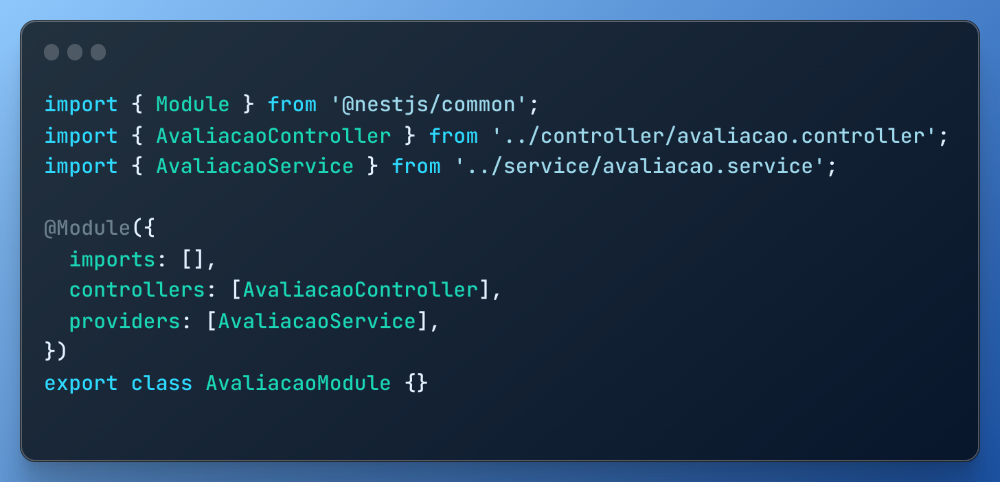

# Estilo Arquitetural *Client Server* e *Dependency Injection*

## Versionamento

<center>

| **Versão** | **Data** | **Modificações** | **Autor(es)** |
| :--: | :--: | :--: | :--: |
| 0.1 | 30/11/2023 | Criação do documento | Felipe Moura, André Corrêa e Gabriel Mariano |
| 0.2 | 30/11/2023 | Documentação das atividades realizadas | Felipe Moura, André Corrêa e Gabriel Mariano |
| 0.3 | 30/11/2023 | Início da Documentação do Código | Felipe Moura, André Corrêa e Gabriel Mariano |
| 0.4 | 30/11/2023 | Finalizando Documentação do Código | Felipe Moura, André Corrêa e Gabriel Mariano |

*Tabela 1: Versionamento*

</center>


## Introdução

Com a proposta de demosntrar o estilo arquitetural _Client-Server_, desenvolvemos uma aplicação em [NestJS](https://nestjs.com) que recebe uma requisição http de um cliente e retorna uma _response_ contendo o conteúdo que foi solicitado.

## Tecnologias

Foram utilizadas as seguintes tecnologias (o tutorial de instalação está linkado em cada tecnologia):

| **Tecnologia** | **Versão** | **Como Instalar/Documentação** |
| :--: | :--: | :--: |
| *NPM* | v10.1.0 | [Como Instalar?](https://www.hostinger.com.br/tutoriais/instalar-node-js-ubuntu) |
| *Node* | v20.9.0 | [Como Instalar?](https://www.digitalocean.com/community/tutorials/how-to-install-node-js-on-ubuntu-20-04) |
| *Yarn* | v1.22.21 | [Como Instalar?](https://classic.yarnpkg.com/lang/en/docs/install/#debian-stable) |
| *Typescript* | --- | [Documentação](https://www.typescriptlang.org/download) | 
| *NestJS* | v10.2.1 | [Como Instalar?](https://docs.nestjs.com/first-steps) |

*Tabela 2: Tecnologias*

## Execução

Após realizar a instalação das tecnologias supracitadas, abra o terminal com a pasta ```amazon-avaliação``` e em seguida, para instalar as dependências execute:

```
npm install
```

ou 

```
yarn install
```

Em seguida, para executar o servidor utilize o comando:

```
yarn start
```

Pronto, agora o servidor deve estar recebendo requisições no endereço ```localhost:8000```.

Para fins de exemplificação foram definidas páginas para três rotas diferentes:


| **Conteúdo da Página** | **Método** | **Rota** |
| :--: | :--: | :--: |
| *Homepage* | *GET* | *localhost:8000* |
| *Sistema de Pontuação* | *GET* | *localhost:8000/pontos* |
| *Sistema de Avaliação* | *GET* | *localhost:8000/avaliacao* |

*Tabela 3: Rotas da Aplicação*


Para uma melhor visualização do HTML com sua devida formatação, é possível utilizar um *browser* para realizar as requisições apresentadas acima ao requisitar as rotas na barra de endereços.

## Resultados Obtidos

Ao se executar o comando ```yarn start```, são apresentadas no terminal informações relativas à inicialização da aplicação e à disponibilização das rotas apresentadas acima, conforme pode ser visto na *Figura 1*:


*Figura 1: Terminal após inicialização da aplicação*

Uma vez após corretamente inicializada a aplicação, serão observadas as requisições feitas na porta 8000, uma vez que seguidas as orientações apresentadas na *Tabela 3*.

Ao acessar a rota referente à *homepage* pelo *browser*, obtém-se como resposta do servidor o conteúdo *HTML* a ser apresentado, o qual por sua vez é apresentado de maneira "formatada" pelo navegador utilizado, conforme pode ser visto na *Figura 2*:

<details>
<summary> <strong> CLIQUE PARA EXIBIR A PRIMEIRA VERSÃO DA HOMEPAGE </strong> </summary>


*Figura 2: Homepage*

</details>

Ao acessar a rota referente ao *sistema de pontuação* pelo *browser*, obtém-se como resposta do servidor o conteúdo *HTML* a ser apresentado, conforme pode ser visto na *Figura 3*:

<details>
<summary> <strong> CLIQUE PARA EXIBIR A PRIMEIRA VERSÃO DO SISTEMA DE PONTUAÇÃO </strong> </summary>


*Figura 3: Sistema de Pontuação*

</details>

Ao acessar a rota referente ao *sistema de avaliação* pelo *browser*, obtém-se como resposta do servidor o conteúdo *HTML* a ser apresentado, conforme pode ser visto na *Figura 4*:

<details>
<summary> <strong> CLIQUE PARA EXIBIR A PRIMEIRA VERSÃO DO SISTEMA DE AVALIAÇÃO </strong> </summary>


*Figura 4: Sistema de Avaliação*

</details>

### Por que o Estilo Arquitetural Cliente-Servidor?

O Estilo Arquitetural Cliente-Servidor fornece uma estrutura para o recebimento, execução e resposta às requisições de um cliente por parte do servidor em questão. Tal estrutura se mostrou adequada para o escopo do projeto apresentado, haja vista a necessidade do cliente para o acesso ao conteúdo disponibilizado pela plataforma *Amazon*, o possível envio de diferentes tipos de dados a partir de *requests* e o recebimento de informações para as respectivas requests enviadas.

Para tal, foi escolhido o *framework NestJS* enquanto responsável pelo recebimento e manejo das requisições e pelo retorno das respostas ao cliente.

O **NestJS** é definido em sua [documentação](https://docs.nestjs.com/) como sendo "um *framework* para a construção de aplicações *Node.js* *'server-side'* eficientes e escaláveis". Dada sua natureza *"server-side"* e seu desenvolvimento voltado ao *back-end*, esse se apresentou como sendo adequado para demonstrar características básicas do estilo arquitetural cliente-servidor.

## Código Desenvolvido

O *framework NestJS* apresenta uma estrutura baseada, em termos gerais, em *modules*, *controllers* e *services*, onde cada um destes possui uma finalidade no manejo de requisições, processamento de dados e retorno das informações requeridas em forma de respostas ao cliente.

Abaixo, são apresentados alguns trechos de código relevantes ao contexto da explicação. Para a geração das imagens do código, foi utilizada a ferramenta [ray.so](https://ray.so).

### Main

O arquivo ```main.ts``` é responsável por instanciar a aplicação e indicar a porta na qual serão recebidas as requisições. Abaixo, o código disponibilizado na *main*:

<details>
<summary> <strong> CLIQUE PARA EXIBIR O CÓDIGO DA MAIN </strong> </summary>


*Figura 5: Main*

</details>

### Modules

Os arquivos ```*.module.ts``` são responsáveis pela organização da estrutura da aplicação e pela gerência de importações, exportações e demais *providers* a serem utilizados. Abaixo, os códigos disponibilizados nos módulos ```app.module.ts```, ```avaliacao.module.ts``` e ```pontos.module.ts```, respectivamente.

<details>
<summary> <strong> CLIQUE PARA EXIBIR O CÓDIGO DO APP MODULE </strong> </summary>


*Figura 6: App Module*

</details>

<details>
<summary> <strong> CLIQUE PARA EXIBIR O CÓDIGO DO AVALIAÇÃO MODULE </strong> </summary>



*Figura 7: Avaliação Module*

</details>

<details>
<summary> <strong> CLIQUE PARA EXIBIR O CÓDIGO DO PONTOS MODULE </strong> </summary>


*Figura 8: Pontos Module*

</details>

### Controllers

Os *controllers*, de certa forma, definem os serviços a serem executados de acordo com a requisição recebida, além de retornarem a informação pedida. Abaixo, os códigos disponibilizados nos *controllers* ```app.controller.ts```, ```avaliacao.controller.ts``` e ```pontos.module.ts```, respectivamente.

<details>
<summary> <strong> CLIQUE PARA EXIBIR O CÓDIGO DO CONTROLLER DO APP </strong> </summary>


*Figura 9: App Controller*

</details>

<details>
<summary> <strong> CLIQUE PARA EXIBIR O CÓDIGO DO CONTROLLER DA AVALIAÇÃO </strong> </summary>


*Figura 10: Avaliação Controller*

</details>

<details>
<summary> <strong> CLIQUE PARA EXIBIR O CÓDIGO DO CONTROLLER DOS PONTOS </strong> </summary>


*Figura 11: Pontos Controller*

</details>

### Services

Os *services* são responsáveis por receber, caso necessário, o conteúdo possivelmente enviado pela requisição, processar os dados, eventualmente realizar conexões com o banco de dados e, por fim, retornar a informação requerida. Abaixo, os códigos disponibilizados nos *services* ```app.service.ts```, ```avaliacao.service.ts``` e ```pontos.service.ts```, respectivamente.

<details>
<summary> <strong> CLIQUE PARA EXIBIR O CÓDIGO DO SERVICE DO APP </strong> </summary>


*Figura 12: App Service*

</details>

<details>
<summary> <strong> CLIQUE PARA EXIBIR O CÓDIGO DO SERVICE DA AVALIAÇÃO </strong> </summary>


*Figura 13: Avaliação Service*

</details>

<details>
<summary> <strong> CLIQUE PARA EXIBIR O CÓDIGO DO SERVICE DOS PONTOS </strong> </summary>


*Figura 14: Pontos Service*

</details>

## Referências

**SERRANO, Milene.** "AULA - ESTILOS E PADRÕES ARQUITETURAIS II". Disponibilizado pela docente em ambiente virtual Moodle. Acesso em 30 nov 2023.

**NESTJS**. "First Steps". Disponível em: <https://docs.nestjs.com/first-steps>. Acesso em 30 nov 2023.

**HOSTINGER TUTORIAIS**. "Como Instalar Node.js e NPM no Ubuntu 18.04, 20.04 e 22.04: 3 Métodos" por Ariane G. Disponível em: <www.hostinger.com.br/tutoriais/instalar-node-js-ubuntu>. Acesso em 30 nov 2023.

**TYPESCRIPT.TV**. "Serving static content with NestJS and Express". Disponível em: <https://typescript.tv/hands-on/serving-static-content-with-nestjs-and-express/?ref=dailydev>. Acesso em 30 nov 2023.

**DIGITAL OCEAN**. "How To Install Node.js on Ubuntu 20.04" por Brian Boucheron. Disponível em: <https://www.digitalocean.com/community/tutorials/how-to-install-node-js-on-ubuntu-20-04>. Acesso em 30 nov 2023.

**NODE JS**. "Installing Node.js via package manager". Disponível em: <https://nodejs.org/en/download/package-manager>. Acesso em 30 nov 2023.

**NESTJS**. "NestJS". Disponível em: <https://nodejs.org/en/download/package-manager>. Acesso em 30 nov 2023. Disponível em: <https://nestjs.com/>. Acesso em 30 nov 2023.

**YARN**. "Installation". Disponível em: <https://classic.yarnpkg.com/lang/en/docs/install/#debian-stable>. Acesso em 30 nov 2023.