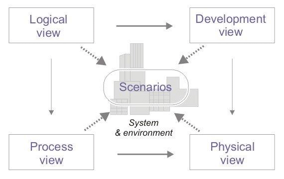
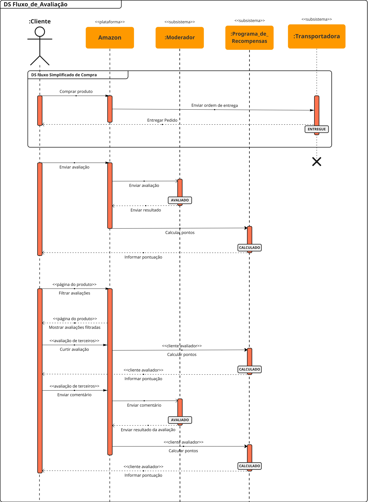
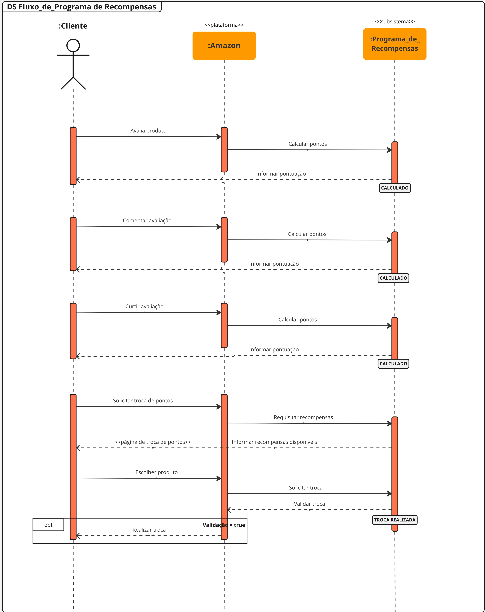
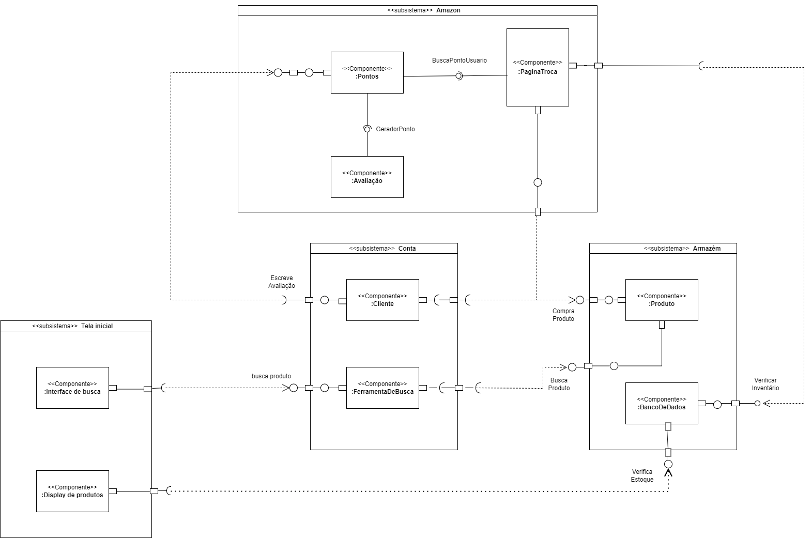
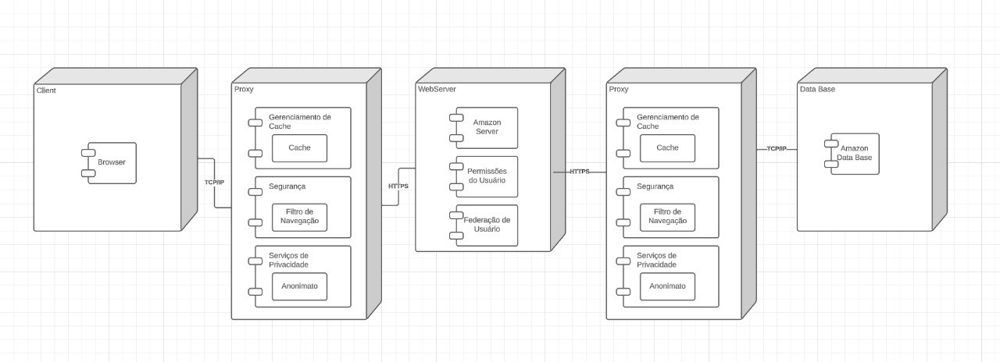

# DAS

## Versionamento

| **Versão** | **Data** | **Modificações** | **Autor(es)** |
| :--: | :--: | :--: | :--: |
| 0.1 | 29/11/2023 | Criação do documento | Felipe Candido de Moura |
| 0.2 | 30/11/2023 | Adição do texto da visão de implemetação | Eduardo, Pedro e Lorenzo |
| 0.3 | 30/11/2023 | Adição de novas estruturas no documento DAS | Diógenes Júnior |
| 0.4 | 30/11/2023 | Adição da estrutura visão de implantação | Diógenes Júnior |
| 0.5 | 30/11/2023 | Adição do diagrama de implantação e documentação de seus respectivos componentes | Diógenes Júnior e Guilherme Kishimoto |

*Tabela 1: Versionamento*

## 1. Introdução

O Documento de Arquitetura de Software (DAS) presente visa descrever o a arquitetura de software do Projeto Amazon feito para a disciplina Arquitetura de Software no semestre 2023.2. O projeto usa como base o sistema de avaliação de produtos da plataforma de _e-commerce_ Amazon. Decidimos por usar o modelo de documento 4+1 (representado na Figura 1), que inclui 4 visões além da visão de caso de uso.

*Figura 1: Ilustração do modelo de visão arquitetural 4+1*

### 1.1 Propósito

O propósito do documento é oferecer diversas visões da arquitetura pensada para o projeto além de casos de uso que envolvem o sistema proposto servindo como referência do que foi desenvolvido.

### 1.2 Escopo

Este documento tem como escopo todo o design de arquitetura desenvolvido no projeto, dando um melhor entendimento do que foi desenvolvido para futuros leitores.

### 1.3 Definições, acrônimos e abreviações

- DAS - Documento de Arquitetura de Software: documento que aborda e descreve a arquitetura de um sistema de software por meio de visões e casos de uso. 

### 1.4 Visão Geral

O resto deste documento, contêm as representações arquiteturais desevolvidas, além de cinco visões diferentes da arquitetura, sendo elas: lógica, de processo, de implementação, de implantação e de casos de uso.

## 2. Representação Arquitetural

### 2.1 Diagrama de Classes

O diagrama de classes é um dos diagramas estáticos UML, sendo tal diagrama utilizado sumariamente para descrever a estrutura estática de um sistema, mostrando as classes, seus atributos, métodos e os relacionamentos entre as classes, fornecendo uma visão estática da estrutura do sistema

>  [Diagrama De Classes](Modelagem/Artefatos/Estaticos/DiagramaDeClasses.md).

### 2.2 Diagrama de Pacotes

Diagramas de pacotes são diagramas estruturais comumente usados para simplificar os diagramas de classe complexos e organizar as classes em pacotes. Um pacote é uma coleção de elementos relacionados, incluindo diagramas, documentos, classes e pacotes de eventos. Além disso, o diagrama de pacotes oferece uma valiosa visibilidade de alto nível para grandes projetos e sistemas.

>  [Diagrama de Pacotes](Modelagem/Artefatos/Estaticos/DiagramadePacotes.md).

### 2.3 Diagrama de Componentes

O diagrama de componentes da UML é uma representação visual que ilustra como as classes devem estar organizadas por meio da noção de componentes de trabalho. Esse diagrama é uma ferramenta poderosa para visualizar a arquitetura de um sistema, mostrando como os diferentes componentes (que podem ser classes, módulos, pacotes ou até mesmo sistemas inteiros) interagem e se relacionam. 

>  [Diagrama de Componentes](Modelagem/Artefatos/Estaticos/DiagramaDeComponente.md).

### 2.4 Diagrama de Sequências

O diagrama de sequência serve como uma representação dos fluxos e sequências do processo de avaliação de produtos em uma plataforma. O diagrama é focado em descrever uma interação ao focar na sequência de mensagens que são trocadas, juntamente com suas especificações de ocorrência correspondentes nas lifelines. 

>  [Diagrama de Sequências](Modelagem/Artefatos/Dinamicos/DiagramaDeSequencia.md).

### 2.5 Diagrama de Atividades

O diagrama de atividades capturam ações e seus resultados. Eles focam o trabalho executado na implementação de uma operação (método), e suas atividades numa instância de um objeto. O Diagrama de atividade mostra o fluxo sequencial das atividades, é normalmente utilizado para demonstrar as atividades executadas por uma operação específica do sistema.

>  [Diagrama de Atividades](Modelagem/Artefatos/Dinamicos/DiagramaDeAtividades.md).

### 2.6 Diagrama de Estados

O diagrama de estados é mais um diagrama de modelagem dinâmica UML, ele consiste em um diagrama apresentando os diferentes estados que podem ser alcnçados durante a utilização do software. Este diagrama modela uma quantidade de processos finitas, evidenciando o ponto de entrada do fluxo, os processos que ocorrem e os seus pontos de saída.

>  [Diagrama de Estados](Modelagem/Artefatos/Dinamicos/DiagramaDeEstados.md).

## 3. Objetivos e Restrições Arquiteturais

## 4. Visão de Casos de Uso

## 5. Visão Lógica

## 6. Visão de Processo

A visão de processo, visa descrever os processos do sistema e suas comunicações de forma à explicitar e facilitar o entendimento das interações entre seus diferentes componentes.

Para o projeto, foram desenvolvidos dois diagramas de sequência que explicitam os processos que envolvem a avaliação de produtos, sendo o primeiro (Figura **X**) referente ao processo de avaliação como um todo, e o segundo (Figura **X**) mais específico ao processo de troca de pontos.

*Figura X: Diagrama de Sequência do Fluxo de Avaliação* 

*Figura X: Diagrama de Sequência do Fluxo de Troca de Pontos* 

## 7. Visão de Implementação 

A visão arquitetural de implemetação tem como objetivo ser mais objetiva nas decisões sobre estruturamento de código, frameworks, reutilização de código, tecnologias, etc. Tendo essa visão em em mente, realizamos uma extensa série de estudos para aprofundar nossa compreensão sobre as nuances da visão arquitetural e da visão de implementação. Foi imperativo revisitar o módulo de UML para compreender como um diagrama de componentes opera. 
 
Após a conclusão desses estudos, os alunos Eduardo, Pedro e Lorenzo elaboraram um diagrama de componente. Com o auxílio  de Arthur, que revisou ambos os diagramas, chegamos à versão final combinada, consolidando os elementos mais eficazes de ambas as versões anteriores. 

## 8. Visão de Implantação

Um diagrama de implantação é um tipo de diagrama UML (Unified Modeling Language) que representa a disposição física de elementos de um sistema em hardware. Ele mostra como os vários componentes de software, como aplicativos, servidores e dispositivos de armazenamento, estão distribuídos em diferentes nós de hardware, como computadores físicos ou máquinas virtuais.

Este documento apresenta a arquitetura de implantação de um sistema distribuído, focado em eficiência, segurança e escalabilidade. O sistema é estruturado em vários nós principais: Cliente, Proxy, Web Server e Database, cada um com componentes e entidades específicas.

### 8.1 Nó Cliente
- Componentes:
  - Browser: Interface de usuário para acesso ao sistema.
- Comunicação:
  - Estabelece uma conexão TCP/IP com o nó Proxy.

### 8.2 Nó Proxy
- Componentes:
  - Gerenciamento de Cache:
    - Entidade Cache: Responsável por armazenar dados frequentemente acessados, melhorando a resposta do sistema.
  - Segurança:
    - Entidade Filtro de Navegação: Filtra requisições para segurança do sistema.
  - Serviços de Privacidade:
    - Entidade Anonimato: Garante a privacidade e anonimato dos usuários.
- Comunicação:
  - Conecta-se ao Web Server via HTTPS.

### 8.3 Nó Web Server
- Componentes:
  - Amazon Server: Servidor de aplicação principal.
  - Permissão de Usuário: Gerencia as permissões e acessos dos usuários.
  - Federação de Usuário: Facilita a autenticação de usuários de diferentes domínios.
- Comunicação:
  - Estabelece uma conexão HTTPS com outro nó Proxy.

### 8.4 Segundo Nó Proxy
- Componentes e Entidades: Mesmos do primeiro nó Proxy.
- Comunicação:
  - Conecta-se ao nó Database via TCP/IP.

### 8.5 Nó Database
- Componentes:
  - Amazon Database: Responsável pelo armazenamento e gerenciamento de dados.

### 8.6 Fluxo de Dados e Controle
1. Do Cliente ao Proxy: O tráfego inicia no Cliente, passa pelo Browser e é direcionado ao Proxy via TCP/IP.
2. Do Proxy ao Web Server: O Proxy processa as requisições, aplicando cache, segurança e privacidade, antes de enviar ao Web Server via HTTPS.
3. Do Web Server ao Database: Após processamento no Web Server, as requisições são encaminhadas através de um segundo Proxy para o Database para operações de dados.

### Conclusão
Este sistema apresenta uma arquitetura robusta e segura, com ênfase em eficiência de processamento, segurança da informação e privacidade do usuário. Cada nó e componente é estrategicamente posicionado para otimizar a performance, segurança e escalabilidade do sistema.

## 9. Tamanho e Performance

## 10. Qualidade 

## Referências

https://www.researchgate.net/figure/4-1-Architectural-View-Model-Software-architecture-descriptions-are-commonly-organized_fig2_311233381

http://repositorio.aee.edu.br/bitstream/aee/1106/3/TCC2_2018_2_GabrielLeiteDias_MatheusLimadeAlbuquerque_Apendice2.pdf
