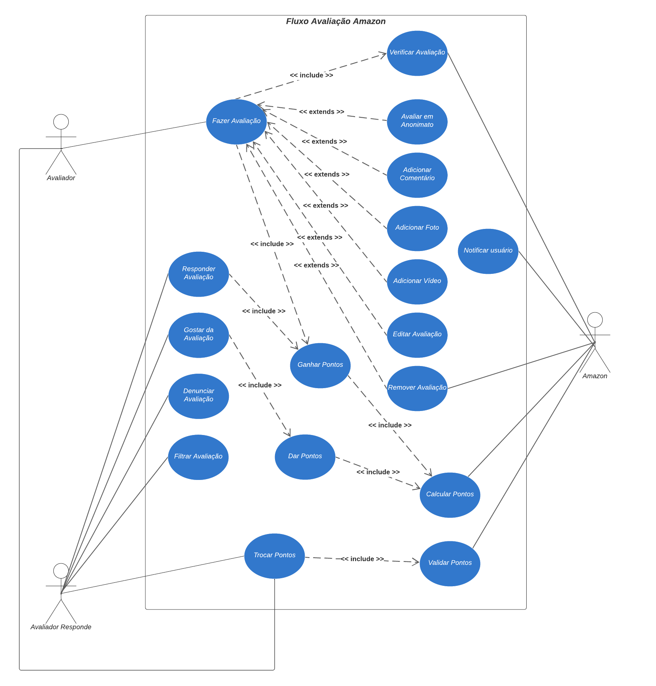
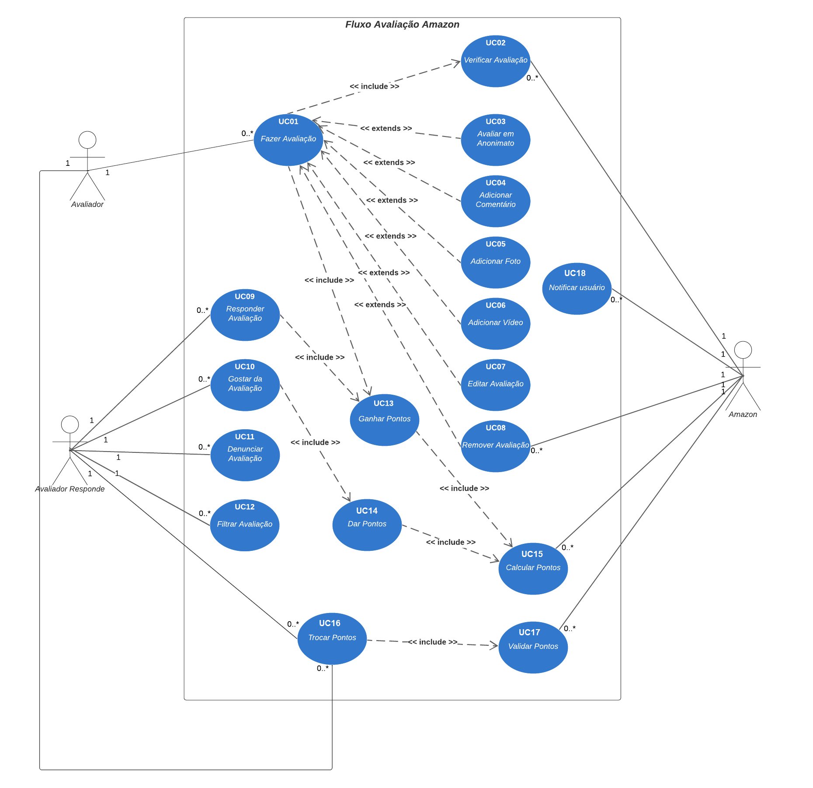
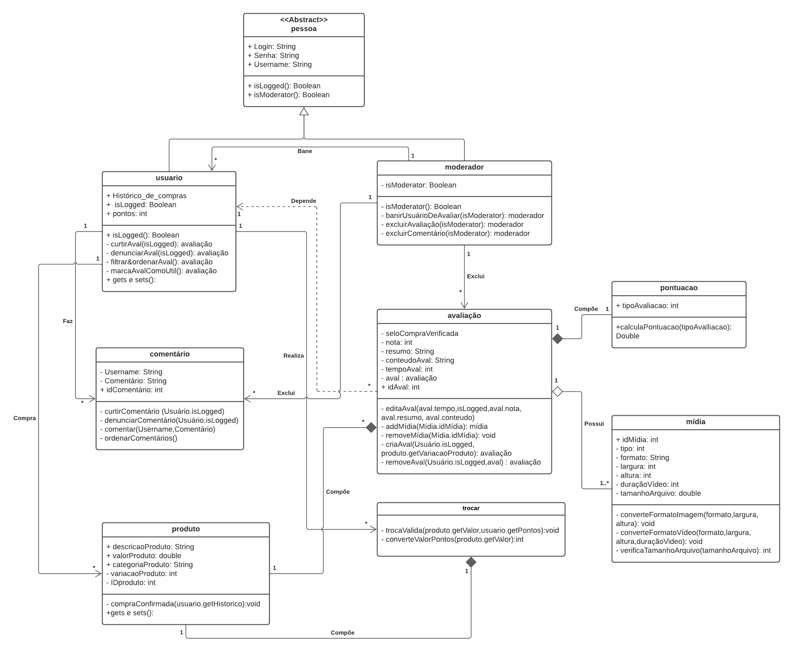
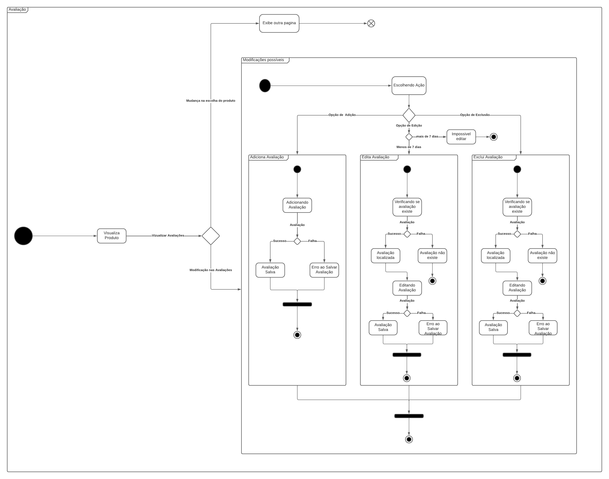
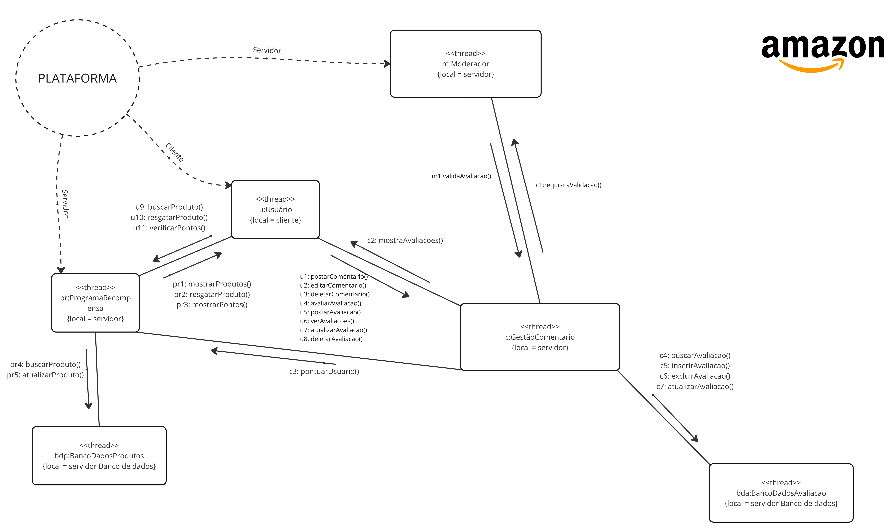

# DAS

## Versionamento

| **Versão** | **Data** | **Modificações** | **Autor(es)** |
| :--: | :--: | :--: | :--: |
| 0.1 | 29/11/2023 | Criação do documento | Felipe Candido de Moura |
| 0.2 | 30/11/2023 | Adição do texto da visão de implemetação | Eduardo, Pedro e Lorenzo |
| 0.3 | 30/11/2023 | Adição de novas estruturas no documento DAS | Diógenes Júnior |
| 0.4 | 30/11/2023 | Adição da estrutura visão de implantação | Diógenes Júnior |
| 0.5 | 30/11/2023 | Adição do diagrama de implantação e documentação de seus respectivos componentes | Diógenes Júnior e Guilherme Kishimoto |
| 0.6 | 30/11/2023 | Adição da visão lógica | Arthur Taylor e Thiago Oliveira |
| 0.7 | 30/11/2023 | Adição do Diagrama de Casos de Uso | André Corrêa, Diógenes Júnior, Felipe Moura, Gabriel Mariano e Guilherme Kishimoto |
| 0.8 | 01/12/2023 | Adição da visão de processo | André Corrêa, Felipe Moura e Gabriel Mariano |
| 0.9 | 01/12/2023 | Refatoração do DCU | André Corrêa e Gabriel Mariano |

*Tabela 1: Versionamento*

## 1. Introdução

O Documento de Arquitetura de Software (DAS) presente visa descrever o a arquitetura de software do Projeto Amazon feito para a disciplina Arquitetura de Software no semestre 2023.2. O projeto usa como base o sistema de avaliação de produtos da plataforma de _e-commerce_ Amazon. Decidimos por usar o modelo de documento 4+1 (representado na Figura 1), que inclui 4 visões além da visão de caso de uso.

*Figura 1: Ilustração do modelo de visão arquitetural 4+1*

### 1.1 Propósito

O propósito do documento é oferecer diversas visões da arquitetura pensada para o projeto além de casos de uso que envolvem o sistema proposto servindo como referência do que foi desenvolvido.

### 1.2 Escopo

Este documento tem como escopo todo o design de arquitetura desenvolvido no projeto, dando um melhor entendimento do que foi desenvolvido para futuros leitores.

### 1.3 Definições, acrônimos e abreviações

- DAS - Documento de Arquitetura de Software: documento que aborda e descreve a arquitetura de um sistema de software por meio de visões e casos de uso. 

### 1.4 Visão Geral

O resto deste documento, contêm as representações arquiteturais desevolvidas, além de cinco visões diferentes da arquitetura, sendo elas: lógica, de processo, de implementação, de implantação e de casos de uso.

## 2. Representação Arquitetural

### 2.1 Diagrama de Classes

O diagrama de classes é um dos diagramas estáticos UML, sendo tal diagrama utilizado sumariamente para descrever a estrutura estática de um sistema, mostrando as classes, seus atributos, métodos e os relacionamentos entre as classes, fornecendo uma visão estática da estrutura do sistema

>  [Diagrama De Classes](Modelagem/Artefatos/Estaticos/DiagramaDeClasses.md).

### 2.2 Diagrama de Pacotes

Diagramas de pacotes são diagramas estruturais comumente usados para simplificar os diagramas de classe complexos e organizar as classes em pacotes. Um pacote é uma coleção de elementos relacionados, incluindo diagramas, documentos, classes e pacotes de eventos. Além disso, o diagrama de pacotes oferece uma valiosa visibilidade de alto nível para grandes projetos e sistemas.

>  [Diagrama de Pacotes](Modelagem/Artefatos/Estaticos/DiagramadePacotes.md).

### 2.3 Diagrama de Componentes

O diagrama de componentes da UML é uma representação visual que ilustra como as classes devem estar organizadas por meio da noção de componentes de trabalho. Esse diagrama é uma ferramenta poderosa para visualizar a arquitetura de um sistema, mostrando como os diferentes componentes (que podem ser classes, módulos, pacotes ou até mesmo sistemas inteiros) interagem e se relacionam. 

>  [Diagrama de Componentes](Modelagem/Artefatos/Estaticos/DiagramaDeComponente.md).

### 2.4 Diagrama de Sequências

O diagrama de sequência serve como uma representação dos fluxos e sequências do processo de avaliação de produtos em uma plataforma. O diagrama é focado em descrever uma interação ao focar na sequência de mensagens que são trocadas, juntamente com suas especificações de ocorrência correspondentes nas lifelines. 

>  [Diagrama de Sequências](Modelagem/Artefatos/Dinamicos/DiagramaDeSequencia.md).

### 2.5 Diagrama de Atividades

O diagrama de atividades capturam ações e seus resultados. Eles focam o trabalho executado na implementação de uma operação (método), e suas atividades numa instância de um objeto. O Diagrama de atividade mostra o fluxo sequencial das atividades, é normalmente utilizado para demonstrar as atividades executadas por uma operação específica do sistema.

>  [Diagrama de Atividades](Modelagem/Artefatos/Dinamicos/DiagramaDeAtividades.md).

### 2.6 Diagrama de Estados

O diagrama de estados é mais um diagrama de modelagem dinâmica UML, ele consiste em um diagrama apresentando os diferentes estados que podem ser alcnçados durante a utilização do software. Este diagrama modela uma quantidade de processos finitas, evidenciando o ponto de entrada do fluxo, os processos que ocorrem e os seus pontos de saída.

>  [Diagrama de Estados](Modelagem/Artefatos/Dinamicos/DiagramaDeEstados.md).

## 3. Visão de Casos de Uso

Casos de uso são uma técnica de modelagem usada para descrever a funcionalidade de um sistema de forma a demonstrar como ele interage com entidades externas, conhecidas como atores. Em essência, um caso de uso descreve quem pode fazer o quê com o sistema em questão. Esta abordagem é utilizada para capturar requisitos funcionais, fornecendo uma visão clara de como o sistema deve se comportar.

Casos de uso elicitados:

| Código  | Descrição do Caso de Uso       |
|---------|--------------------------------|
| UC01    | Fazer Avaliação                |
| UC02    | Verificar Avaliação            |
| UC03    | Avaliar em Anonimato           |
| UC04    | Adicionar Comentário           |
| UC05    | Adicionar Foto                 |
| UC06    | Adicionar Vídeo                |
| UC07    | Editar Avaliação               |
| UC08    | Remover Avaliação              |
| UC09    | Responder Avaliação            |
| UC10    | Gostar da Avaliação            |
| UC11    | Denunciar Avaliação            |
| UC12    | Filtrar Avaliação              |
| UC13    | Ganhar Pontos                  |
| UC14    | Dar Pontos                     |
| UC15    | Calcular Pontos                |
| UC16    | Trocar Pontos                  |
| UC17    | Validar Pontos                 |
| UC18    | Notificar Usuário              |

Tabela 2: Casos de uso elicitados

 

Nosso diagrama de casos de uso foi elaborado com foco no fluxo de avaliação da Amazon, cobrindo dois aspectos principais: o processo de realização de avaliações e o sistema de pontuação. Esta abordagem ajuda a mapear todas as interações possíveis dos usuários com o sistema ao avaliar produtos, além de gerenciar um sistema de recompensas baseado em pontos.

- **Processo de Avaliação:** Inclui ações como fazer, verificar, editar e remover avaliações, além de responder e denunciar avaliações.
- **Sistema de Pontuação:** Envolve a dinâmica de ganhar, dar, calcular, trocar e validar pontos como parte do sistema de recompensas.

Para desenvolver este diagrama, os integrantes André, Diógenes, Felipe, Gabriel Mariano e Guilherme se reuiniram e revisamos os artefatos da entrega base. Cujo utilizamos principalmente: mapa mental, brainstorm e o Rich Picture. Esses recursos foram essenciais para nos orientar na identificação e definição dos casos de uso.

Com base nessa análise, decidimos sobre os casos de uso apresentados. Eles refletem não apenas as funcionalidades existentes do sistema da Amazon, mas também inovações propostas por nossa equipe, como a possibilidade de fazer avaliações anônimas e um sistema de pontuação mais envolvente, por exemplo. Abaixo, segue o diagrama de casos de uso:

### Primeira versão do diagrama de casos de uso (DCU)

 <strong> CLIQUE PARA EXIBIR A PRIMEIRA VERSÃO DO DCU </strong> 

*Figura 2: Diagrama de casos de uso versão 1*

### Segunda versão do diagrama de casos de uso (DCU)

*Figura 3: Diagrama de casos de uso versão 2*

## 4. Visão Lógica

A visão lógica busca tratar sobre a estruturação e a organização do sistema, destacando os pontos chaves do projeto como por exemplo as classes, pacotes, estados e afins.

Foram desenvolvidos os diagramas de classe e estados que buscam refletir o processo de avaliação de um produto dentro da aplicação da amazon.

*Figura 4: Diagrama de Classes de Avaliação de um produto*

Este diagrama foi elaborado buscando observar e entender as classes existentes na aplicação e como elas se relacionam no escopo analisado, de avaliação de um produto. Com isso esta versão final deste diagrama possui a modelagem dos pontos identificados pelo grupo durante o projeto.

*Figura 5: Diagrama de Estados de Avaliação de um produto* 

O diagrama de estados busca evidenciar os fluxos que ocorrem quando um usuário avalia um produto, evidenciando como o sistema se comporta com a navegação do usuário, este diagrama é deveras importante para entender como o sistema trataria as ações do usuário.

Ambos os diagramas foram desenvolvidos buscando analisar o escopo de avaliar um produto por parte de um usuário, escopo este definido no início do projeto.

## 5. Visão de Processo

Para o projeto, foi desenvolvidos um diagrama de processo que explicíta tais processos em forma de _threads_ que executam atividades essênciais do sistema. As interações são feitas por meio de funções representativas que guiam o fluxo de processo com base no que é possível ser realizado.

*Figura 6: Diagrama de Processo*

Abaixo estão descritas as funções referentes aos principais processos:

### Usuário

| Nome | Descrição | Destino |
|------|-----------|---------|
| u1: postarComentario() | Posta um comentário | GestãoComentário |
| u2: editarComentario() | Edita um comentário | GestãoComentário |
| u3: deletarComentario() | Deleta um comentário | GestãoComentário |
| u4: avaliarAvaliacao() |  Avalia uma avaliação já existente | GestãoComentário |
| u5: postarAvaliacao() | Posta uma avaliação de um produto | GestãoComentário |
| u6: verAvaliacoes() | Visualiza as avaliações existentes | GestãoComentário |
| u7: atualizarAvaliacao() | Atualiza uma avaliação | GestãoComentário |
| u8: deletarAvaliacao() | Deleta uma avaliação | GestãoComentário |
| u9: buscarProduto() | Busca os produtos aptos a serem trocados | ProgramaRecompensa |
| u10: resgatarProduto() | Resgata um produto em troca de pontos | ProgramaRecompensa |
| u11: verificarPontos() | Verifica os pontos já obtidos | ProgramaRecompensa |

*Tabela 3: Descrição do processo Usuário*

### Moderador

| Nome | Descrição | Destino |
|------|-----------|---------|
| m1: validaAvaliacao() | Retorna se um comentário foi validado ou não | GestãoComentário |

*Tabela 4: Descrição do processo Moderador*

### ProgramaRecompensa

| Nome | Descrição | Destino |
|------|-----------|---------|
| pr1: mostrarProdutos() | Retorna os produtos disponíveis para troca | Usuário |
| pr2: resgatarProduto() | Valida e realiza a troca se foi bem sucedida | Usuário |
| pr3: mostrarPontos() | Retorna a quantidade de pontos do usuário| Usuário |
| pr4: buscarProduto() | Busca os produtos disponíveis no banco de dados de produtos | BancoDadosProdutos |
| pr5: atualizarProduto() | Atualiza o estado dos produtos (disponível/indisponível) | BancoDadosProdutos |

*Tabela 5: Descrição do processo ProgramaRecompensa*

### GestãoComentário

| Nome | Descrição | Destino |
|------|-----------|---------|
| c1: requisitaValidacao() | Requisita a validação de um comentráio | Moderador |
| c2: mostraAvaliacoes() | Retorna as avaliações existentes | Usuário |
| c3: pontuarUsuario() | Pontua o usuário com base nas avaliações e reações a comentários feita | ProgramaRecompensa |
| c4: buscarAvaliacao() | Busca as avaliações existentes no banco de dados | BancoDadosAvaliacao |
| c5: inserirAvaliacao() | Inseri uma nova avaliação no banco de dados | BancoDadosAvaliacao |
| c6: excluirAvaliacao() | Exclui uma avaliação do banco de dados | BancoDadosAvaliacao |
| c7: atualizarAvaliacao() | Atualiza uma avaliação do banco de dados| BancoDadosAvaliacao |

*Tabela 6: Descrição do processo GestãoComentário*

## 6. Visão de Implementação 

A visão arquitetural de implemetação tem como objetivo ser mais objetiva nas decisões sobre estruturamento de código, frameworks, reutilização de código, tecnologias, etc. Tendo essa visão em em mente, realizamos uma extensa série de estudos para aprofundar nossa compreensão sobre as nuances da visão arquitetural e da visão de implementação. Foi imperativo revisitar o módulo de UML para compreender como um diagrama de componentes opera. 
 
Após a conclusão desses estudos, os alunos Eduardo, Pedro e Lorenzo elaboraram um diagrama de componente. Com o auxílio  de Arthur, que revisou ambos os diagramas, chegamos à versão final combinada, consolidando os elementos mais eficazes de ambas as versões anteriores. 

## 7. Visão de Implantação

Um diagrama de implantação é um tipo de diagrama UML (Unified Modeling Language) que representa a disposição física de elementos de um sistema em hardware. Ele mostra como os vários componentes de software, como aplicativos, servidores e dispositivos de armazenamento, estão distribuídos em diferentes nós de hardware, como computadores físicos ou máquinas virtuais.

Este documento apresenta a arquitetura de implantação de um sistema distribuído, focado em eficiência, segurança e escalabilidade. O sistema é estruturado em vários nós principais: Cliente, Proxy, Web Server e Database, cada um com componentes e entidades específicas.

### 7.1 Nó Cliente
- Componentes:
  - Browser: Interface de usuário para acesso ao sistema.
- Comunicação:
  - Estabelece uma conexão TCP/IP com o nó Proxy.

### 7.2 Nó Proxy
- Componentes:
  - Gerenciamento de Cache:
    - Entidade Cache: Responsável por armazenar dados frequentemente acessados, melhorando a resposta do sistema.
  - Segurança:
    - Entidade Filtro de Navegação: Filtra requisições para segurança do sistema.
  - Serviços de Privacidade:
    - Entidade Anonimato: Garante a privacidade e anonimato dos usuários.
- Comunicação:
  - Conecta-se ao Web Server via HTTPS.

### 7.3 Nó Web Server
- Componentes:
  - Amazon Server: Servidor de aplicação principal.
  - Permissão de Usuário: Gerencia as permissões e acessos dos usuários.
  - Federação de Usuário: Facilita a autenticação de usuários de diferentes domínios.
- Comunicação:
  - Estabelece uma conexão HTTPS com outro nó Proxy.

### 7.4 Segundo Nó Proxy
- Componentes e Entidades: Mesmos do primeiro nó Proxy.
- Comunicação:
  - Conecta-se ao nó Database via TCP/IP.

### 7.5 Nó Database
- Componentes:
  - Amazon Database: Responsável pelo armazenamento e gerenciamento de dados.

### 7.6 Fluxo de Dados e Controle
1. Do Cliente ao Proxy: O tráfego inicia no Cliente, passa pelo Browser e é direcionado ao Proxy via TCP/IP.
2. Do Proxy ao Web Server: O Proxy processa as requisições, aplicando cache, segurança e privacidade, antes de enviar ao Web Server via HTTPS.
3. Do Web Server ao Database: Após processamento no Web Server, as requisições são encaminhadas através de um segundo Proxy para o Database para operações de dados.

### Conclusão
Este sistema apresenta uma arquitetura robusta e segura, com ênfase em eficiência de processamento, segurança da informação e privacidade do usuário. Cada nó e componente é estrategicamente posicionado para otimizar a performance, segurança e escalabilidade do sistema.

<!--

## 9. Tamanho e Performance

## 10. Qualidade 
-->

## Referências

https://www.researchgate.net/figure/4-1-Architectural-View-Model-Software-architecture-descriptions-are-commonly-organized_fig2_311233381

http://repositorio.aee.edu.br/bitstream/aee/1106/3/TCC2_2018_2_GabrielLeiteDias_MatheusLimadeAlbuquerque_Apendice2.pdf

https://www.cin.ufpe.br/~gta/rup-vc/core.base_rup/guidances/concepts/logical_view_C135365E.html

[Diagrama de Processos - grupo 2 2023.1](https://github.com/UnBArqDsw2023-1/2023.1_G2_ProjetoMercadoLivre/blob/main/docs/Assets/diagramas/ProcessosV1.png)

https://docs.aws.amazon.com/pt_br/