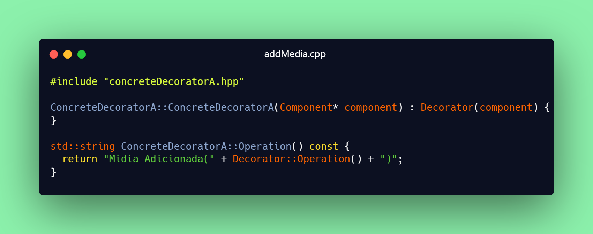
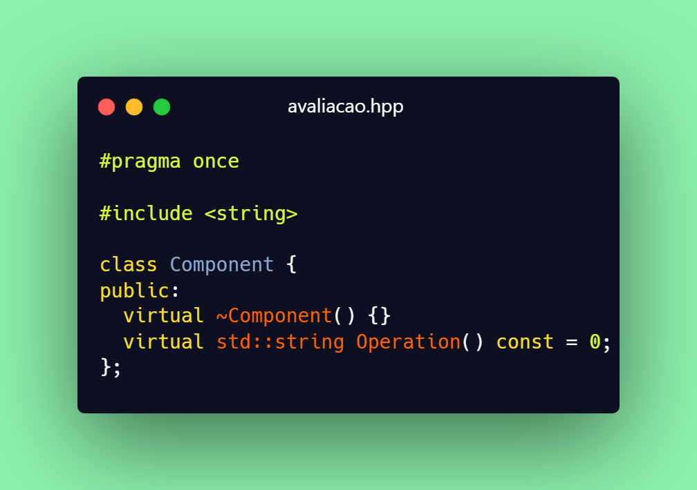
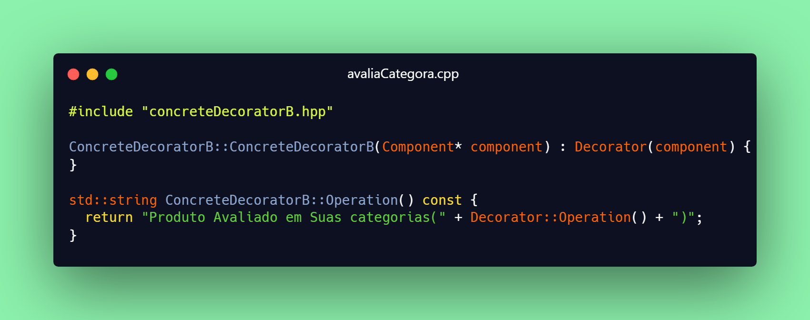
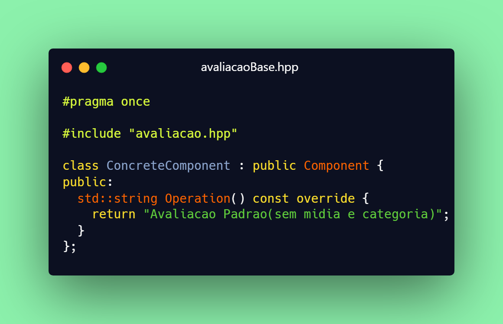
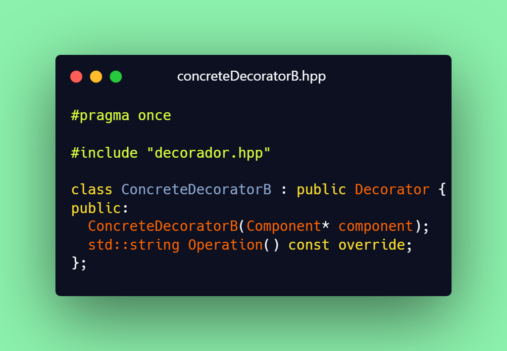
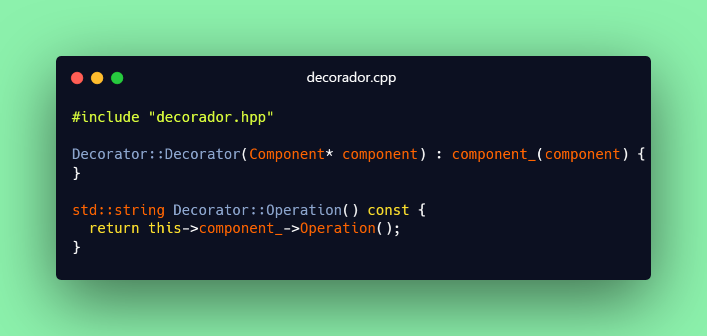
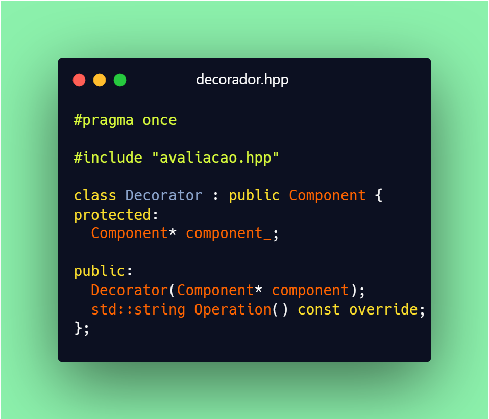
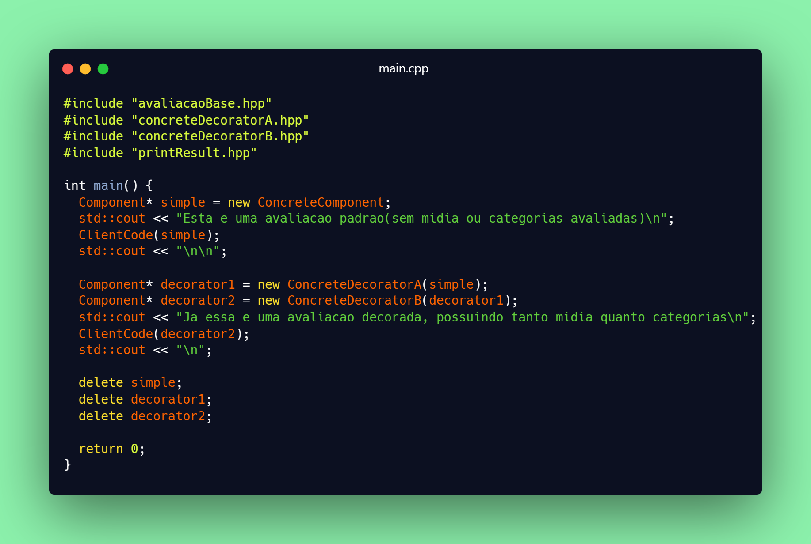
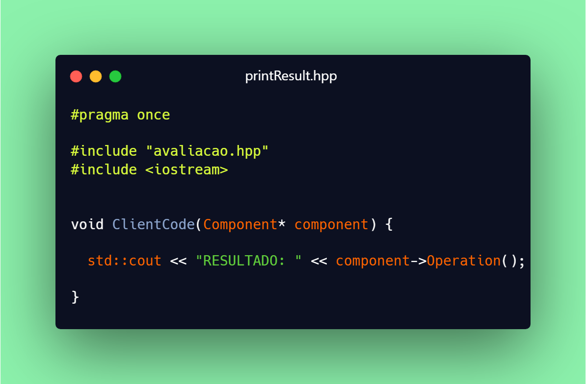
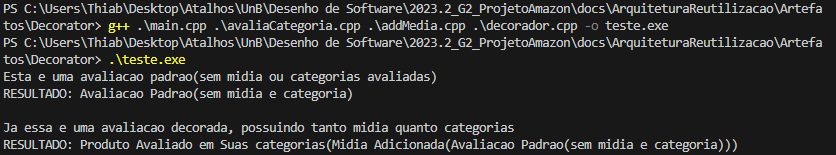

# Padrão Arquitetura _Decorator_

## Versionamento

| **Versão** |  **Data**  |         **Modificações**         |         **Autor(es)**           |
| :--------: | :--------: | :------------------------------: | :-----------------------------: | 
|    0.1     | 30/11/2023 |       Criação do documento       | Arthur Taylor e Thiago Oliveira |
|    0.2     | 30/11/2023 |       Revisão do documento       | Arthur Taylor e Thiago Oliveira |
|    0.3     | 01/12/2023 |       *Quickfix*: Nome do Padrão *Decorator* no Título       | André Corrêa e Gabriel Mariano |

_Tabela 1: Versionamento_

## Introdução

Com a proposta de demonstrar o padrão de projeto Decorator, desenvolvemos um código em C++ que representa as classes do padrão escolhido, visto que este padrão de projeto foi identificado pelo grupo como um padrão que se encaixa no escopo analisado.

## Tecnologias

| **Tecnologia** | **Versão** |                                       **Como Instalar/Documentação**                                       |
| :------------: | :--------: | :--------------------------------------------------------------------------------------------------------: |
|     _G++_      |    v17     | [Como Instalar Windonws?](https://terminalroot.com.br/2022/12/como-instalar-gcc-gpp-mingw-no-windows.html) |
|     _G++_      |    v17     |                       [Como Instalar Linux?](https://pt.linux-console.net/?p=15650)                        |

_Tabela 2: Tecnologias_

## Por que o Padrão de Projeto Decorator?

O padrão de projeto decorator é um padrão que nos permite incluir novos comportamentos à objetos, isso foi identificado pelo grupo como uma boa forma de se tratar a avaliação de um produto. Uma vez que o padrão nos proporciona uma modularidade muito grande, o que é buscado quando analisamos o escopo de avaliaçãoes, uma vez que as avaliações possuem um centro que deve ser preenchido, mas possui também várias partes que constam como opcional, por isso o padrão de projeto foi escolhido.

Por exemplo, uma avaliação deve conter uma avaliação em estrelas do produto, um resumo da avaliação que será postada e também deve conter um texto explicativo da sua avaliação, mas isso não é tudo, uma avaliação pode conter também outras informações como por exemplo fotos do produto recebido. Com isso a modularidade explicada acima se faz muito nescessária para que os desenvolvedores não tenham uma grande quantidade de retrabalho além de previnir um grande acomplamento e permitir a escalabilidade do sistema.

Está dividio em 4 arquivos e 6 bibliotecas:

| **Nome** |  **Funcionalidade**  |
| :---------------------------: | :-----------------------------------------: | 
|    addMedia.cpp               | Adicona Mídia a avaliação                   |
|    avaliaCategoria.cpp        | Adiciona avaliações na forma de estrelas    |
|    decorator.cpp              | Retorna o objeto final para exibição        |
|    main.cpp                   | Faz com que a avaliação utilize o decorator |
|    avaliacao.hpp              | Contém as assinaturas e classes utilizadas  |
|    avaliacaoBase.hpp          | Contém as assinaturas e classes utilizadas  |
|    concreteDecoratorA.hpp     | Contém as assinaturas e classes utilizadas  |
|    concreteDecoratorB.hpp     | Contém as assinaturas e classes utilizadas  |
|    decorator.hpp              | Contém as assinaturas e classes utilizadas  |
|    printResult.hpp            | Contém as assinaturas e classes utilizadas  |

## Código Desenvolvido

 <strong> CLIQUE PARA EXIBIR O CÓDIGO </strong> 

_Figura 1: Código do addMedia.cpp_

_Figura 2: Código do avaliacao.hpp_

_Figura 3: Código do avaliaCategoria.cpp_

_Figura 4: Código do avaliacaoBase.hpp_

_Figura 5: Código do concreteDecoratorA.hpp_

_Figura 6: Código do concreteDecoratorB.hpp_

_Figura 7: Código do decorador.cpp_

_Figura 8: Código do decorador.hpp_

_Figura 9: Código do main.cpp_

_Figura 10: Código do printResult.hpp_

## Execução e Resultados Obtidos

A execução do código é feita através do terminal utilizando uma linha de comando descrita abaixo:

 <strong> CLIQUE PARA EXIBIR O COMANDO E OS RESULTADOS </strong> 

_Figura 11: Comando para executar e resultados_

## Referências

> <a id="FTF1Ref" href="#FTF1">1.</a> [Aprender Arquitetura e Desenho de Software – Começando Professor(a): Milene Serrano](https://aprender3.unb.br/course/view.php?id=19535&section=1). Acessado em: 29 de setembro de 2023.

> <a id="FTF1Ref" href="#FTF1">2.</a> [C++ Documentação](https://cplusplus.com/). Acessado em: 30 de setembro de 2023.

> <a id="FTF1Ref" href="#FTF1">3.</a> [Refactoring Guru Decorator](https://refactoring.guru/design-patterns/decorator). Acessado em: 29 de setembro de 2023.
