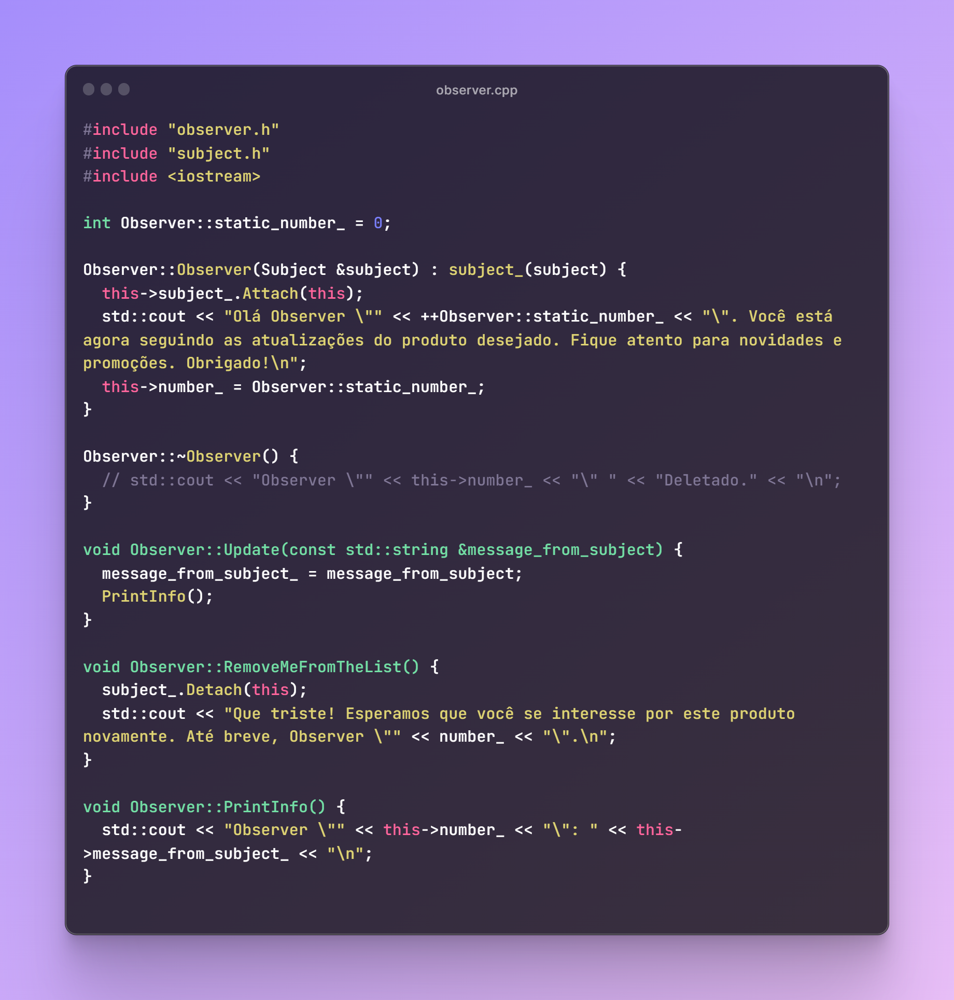
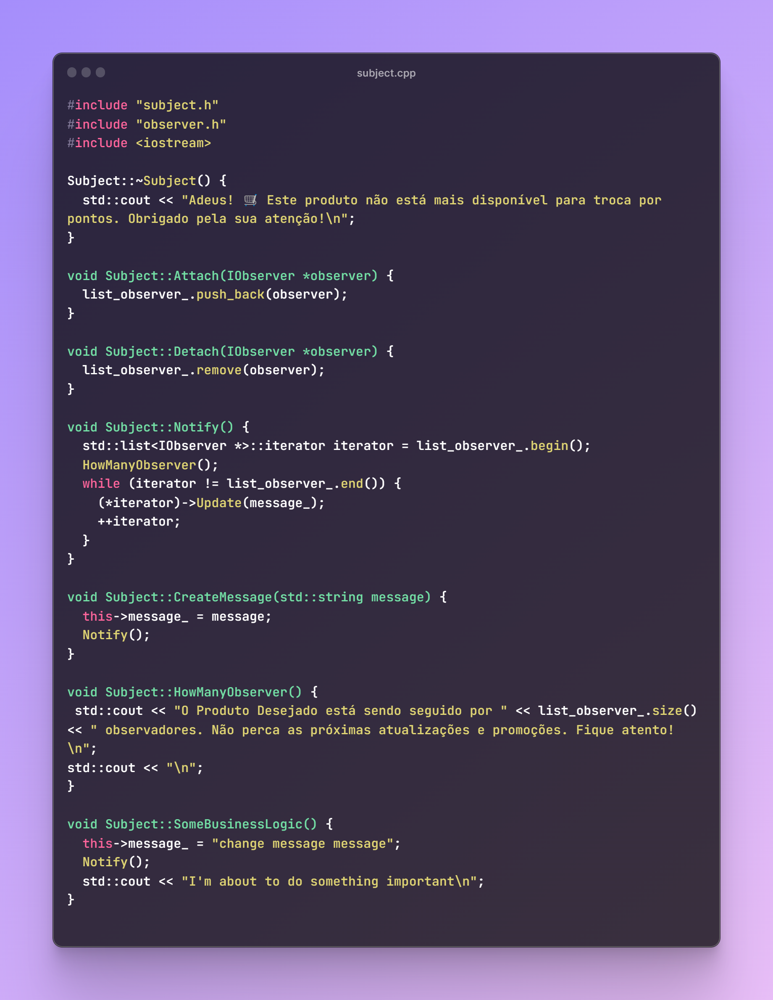
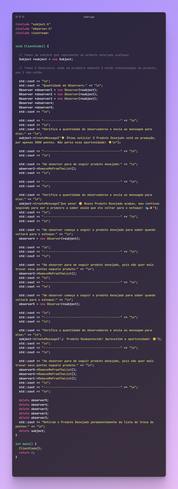
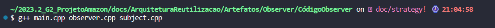
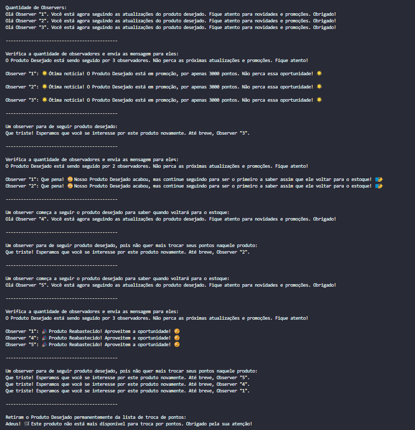

# Padrão Arquitetura _Observer_

## Versionamento

| **Versão** |  **Data**  |         **Modificações**         |         **Autor(es)**          |
| :--------: | :--------: | :------------------------------: | :----------------------------: |
|    0.1     | 30/11/2023 |       Criação do documento       | Pedro Lucas, Lorenzo e Eduardo |
|    0.2     | 30/11/2023 | Adição de Código C++ do Obersver | Pedro Lucas, Lorenzo e Eduardo |

_Tabela 1: Versionamento_

## Introdução

Com a proposta de demonstrar do padrão de projeto Observer, desenvolvemos um código em C++ que representa as classes do padrão escolhido.

## Tecnologias

| **Tecnologia** | **Versão** |                                       **Como Instalar/Documentação**                                       |
| :------------: | :--------: | :--------------------------------------------------------------------------------------------------------: |
|     _G++_      |    v17     | [Como Instalar Windonws?](https://terminalroot.com.br/2022/12/como-instalar-gcc-gpp-mingw-no-windows.html) |
|     _G++_      |    v17     |                       [Como Instalar Linux?](https://pt.linux-console.net/?p=15650)                        |

_Tabela 2: Tecnologias_

## Por que o Padrão de Projeto Observer?

A implementação do padrão Observer em nosso projeto de sistema de avaliação da Amazon estabelece uma sólida fundação para a expansão planejada dos serviços dentro do nosso escopo, especialmente no contexto do sistema de troca de pontos. Essa abordagem oferece uma estrutura organizada e modular, permitindo uma maior participação dos clientes por meio de notificações relacionadas a produtos que podem ser trocados por pontos, os quais são adquiridos através de avaliações. Isso contribui para envolver os clientes em diferentes aspectos do site, promovendo uma interação mais abrangente e enriquecedora.

Ao realizar uma avaliação, os clientes da Amazon acumularão pontos que poderão ser trocados por produtos específicos, os quais estarão disponíveis em uma seção dedicada na plataforma. Implementaremos notificações para manter os clientes informados sobre alterações relevantes, como adição ou remoção de estoque, promoções, inclusão ou exclusão de produtos. Essas notificações visam proporcionar uma experiência mais proativa aos clientes, mantendo-os atualizados sobre eventos importantes que podem influenciar suas escolhas e interações dentro da plataforma Amazon.

Está dividio em 3 arquivos e 2 bibliotecas:

- observer.cpp: Carrega o conteúdo relacionado ao Observer;
- subject.cpp: Carrega o conteúdo relacionado ao Subject;
- main.cpp: É o código cliente que irá se comunicar com os observer e subject;
- observer.h e subject.h: Contém as assinaturas e classes utilizadas.

## Código Desenvolvido

[!NOTE]  
O código apresentado abaixo pode ser encontrado no [Repositório do GitHub](https://github.com/UnBArqDsw2023-2/2023.2_G2_ProjetoAmazon/tree/main/docs/ArquiteturaReutilizacao/Artefatos/Observer/C%C3%B3digoObserver).

 <strong> CLIQUE PARA EXIBIR O CÓDIGO </strong> 

_Figura 1: Código do observer.cpp_

_Figura 2: Código do subject.cpp_

_Figura 3: Código do main.cpp_

## Execução

A execução do código é feita através do terminal utilizando uma linha de comando descrita abaixo:

 <strong> CLIQUE PARA EXIBIR O COMANDO </strong> 

_Figura 4: Comando para executar_

## Resultados Obtidos

 <strong> CLIQUE PARA EXIBIR OS RESULTADOS </strong> 

_Figura 5: Resultados Obtidos_

## Referências

> <a id="FTF1Ref" href="#FTF1">1.</a> [Aprender Arquitetura e Desenho de Software – Começando Professor(a): Milene Serrano](https://aprender3.unb.br/course/view.php?id=19535&section=1). Acessado em: 29 de setembro de 2023.

> <a id="FTF1Ref" href="#FTF1">2.</a> [C++ Documentação](https://cplusplus.com/). Acessado em: 30 de setembro de 2023.

> <a id="FTF1Ref" href="#FTF1">3.</a> [Refactoring Guru Strategy](https://refactoring.guru/design-patterns/strategy). Acessado em: 29 de setembro de 2023.
