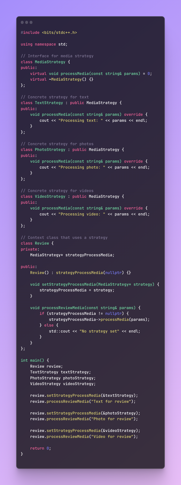
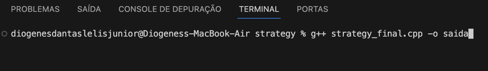
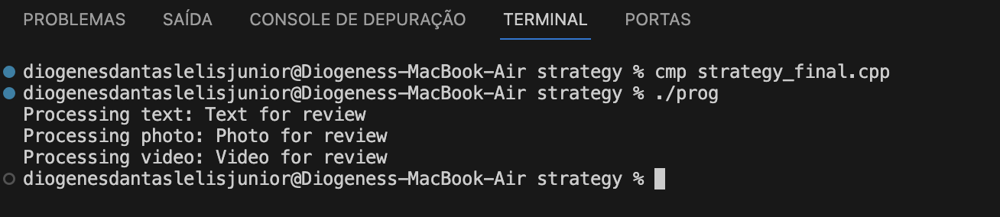

# Padrão Arquitetura *Strategy*

## Versionamento

| **Versão** | **Data** | **Modificações** | **Autor(es)** |
| :--: | :--: | :--: | :--: |
| 0.1 | 30/11/2023 | Criação do documento | Diógenes Júnior e Guilherme Kishimoto |
| 0.2 | 30/11/2023 | Adição de Código C++ do Strategy | Diógenes Júnior e Guilherme Kishimoto |

*Tabela 1: Versionamento*

## Introdução

Com a proposta de demosntrar do padrão de projeto Strategy, desenvolvemos um código em C++ que representa as classes do padrão escolhido.

## Tecnologias

| **Tecnologia** | **Versão** | **Como Instalar/Documentação** |
| :--: | :--: | :--: |
| *G++* | v17 | [Como Instalar Windonws?](https://terminalroot.com.br/2022/12/como-instalar-gcc-gpp-mingw-no-windows.html) |
| *G++* | v17 | [Como Instalar Linux?](https://pt.linux-console.net/?p=15650) |

*Tabela 2: Tecnologias*

## Por que o Padrão de Projeto Strategy?

A escolha do padrão Strategy para nosso projeto de sistema de avaliação da Amazon oferece uma base para a manutenção eficiente e a expansão potencial. Este método assegura uma abordagem organizada e modular, preparando o sistema para adaptações e inovações futuras em avaliações de produtos. 

Implementamos o padrão Strategy para gerir diferentes tipos de avaliações – texto, foto e vídeo.

Cada formato de avaliação é gerenciado por uma estratégia específica: TextStrategy, PhotoStrategy e VideoStrategy. Isso assegura que cada tipo de avaliação tenha um algoritmo de processamento distinto, operando de forma independente. Essa separação facilita a manutenção e a atualização do sistema.

Ao considerar futuras expansões, como a possibilidade de incluir avaliações em áudio, por exemplo, o padrão Strategy demonstra seu valor. A implementação dessa nova funcionalidade exigiria apenas a criação de uma nova classe, como AudioStrategy. Esta classe seguiria a interface MediaStrategy, integrando-se facilmente ao sistema existente sem a necessidade de alterar as funcionalidades já implementadas.

## Código Desenvolvido

 <strong> CLIQUE PARA EXIBIR O CÓDIGO </strong> 

*Figura 1: Código cpp*

## Execução

A execução do código é feita através do terminal utilizando uma linha de comando descrita abaixo:

 <strong> CLIQUE PARA EXIBIR O COMANDO </strong> 

*Figura 2: Comando para executar*

## Resultados Obtidos

 <strong> CLIQUE PARA EXIBIR OS RESULTADOS </strong> 

*Figura 3: Homepage*

## Referências

> <a id="FTF1Ref" href="#FTF1">1.</a> [Aprender Arquitetura e Desenho de Software – Começando Professor(a): Milene Serrano](https://aprender3.unb.br/course/view.php?id=19535&section=1). Acessado em: 29 de setembro de 2023.

> <a id="FTF1Ref" href="#FTF1">2.</a> [C++ Documentação](https://cplusplus.com/). Acessado em: 30 de setembro de 2023.

> <a id="FTF1Ref" href="#FTF1">3.</a> [Refactoring Guru Strategy](https://refactoring.guru/design-patterns/strategy). Acessado em: 29 de setembro de 2023.
