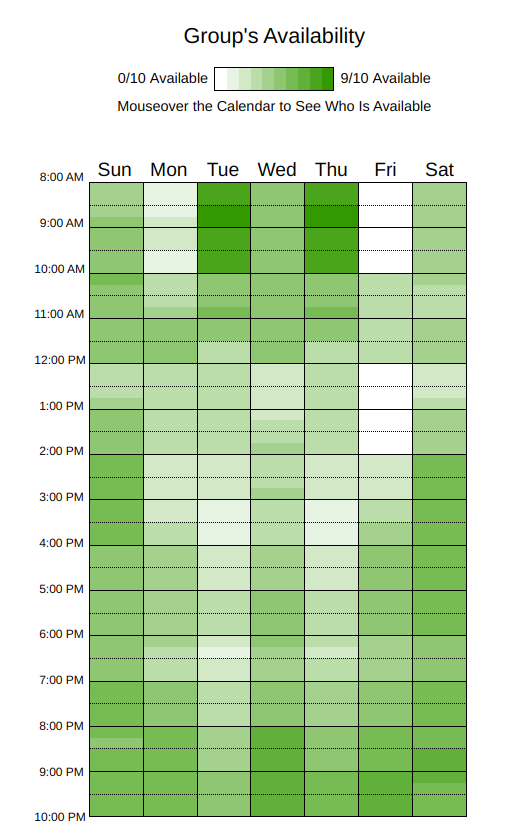

# Quinta Reunião

| **Data** | **Horário** | **Autor(es)** |
| :--: | :--: | :--: |
| 03/10/2023 | 09:00 | Todos os presentes |

*Tabela 1: Momento da Reunião*

## Versionamento

| **Versão** | **Data** | **Modificações** | **Autor(es)** |
| :--: | :--: | :--: | :--: |
| 0.1 | 03/10/2023 | Criação da ata e documentação da reunião | Gabriel, André, Diógenes, Arthur, Felipe, Guilherme, Lorenzo e Pedro |
| 0.2 | 06/10/2023 | Adição do *Heatmap* de disponibilidade dos integrantes da equipe | André Corrêa e Gabriel Mariano |

*Tabela 2: Versionamento*

## Participantes

- Gabriel Mariano
- André Corrêa
- Diógenes Júnior
- Arthur Taylor
- Felipe Moura
- Guilherme Kishimoto
- Lorenzo Santos
- Pedro Lucas
<!-- - Eduardo Schuindt -->
<!-- - Thiago Oliveira -->

## Objetivo

O objetivo da reunião é, primeiramente, levantar os horários de disponibilidade para todos os membros da equipe, de modo a permitir um melhor planejamento de reuniões e demais encontros para eventuais atividades. Além disso, busca-se revisar os aspectos apresentados no *feedback* dado para a última entrega e já dividir as atividades necessárias para a próxima entrega.

## Definições

Foram definidos os diagramas a serem realizados:

- Foco 1 - Modelagem UML Estática:
  - Diagrama de Classes:
    - Arthur e Thiago
  - Diagrama de Pacotes:
    - Diógenes e Guilherme
  - Diagrama de Componentes:
    - Pedro, Lorenzo e Eduardo
  - Revisão dos Artefatos:
    - André, Felipe e Gabriel

- Foco 2 - Modelagem UML Dinâmica:
  - Diagrama de Sequência:
    - André, Felipe e Gabriel
  - Diagrama de Atividades:
    - Diógenes e Guilherme
  - Diagrama de Estados:
    - Arthur e Thiago
  - Revisão:
    - Pedro, Lorenzo e Eduardo

- Participações:
  - Documentação das Participações
    - Todos

- Organização do SCRUM:
  - André, Felipe e Gabriel

Foi definida a data de entrega dos diagramas para a revisão: 06/10/23 (à noite).

Também foi definida a data de documentação das participações: 08/10/23.

## Pendências

- Elicitar requisitos para o *brainstorm*.
- Organização do SCRUM.

## Observações

O *heatmap* gerado a partir dos horários de disponibilidade dos membros do grupo é apresentado abaixo. As seções com tonalidade de graduação mais escura representam os momentos de maior disponibilidade dos membros da equipe na semana. Em contraponto, as áreas de maior palidez representam horários de menor disponibilidade dos integrantes.

*Figura 1: Heatmap de Disponibilidade dos Membros*

Acima, é notável a maior disponibilidade dos integrantes nas manhãs de terças e quintas, entre os períodos de 08:00 e 10:00, de modo que estes períodos serão priorizados para a realização de reuniões ao longo do projeto.

| **Data** | **Participantes** | **Ferramenta Utilizada** |
| :--: | :--: | :--: |
| 03/10/2023 | Todos os membros do grupo | [when2meet](https://www.when2meet.com/) |

*Tabela 3: Documentação do Heatmap*

## Próxima Reunião

A data para a próxima reunião dependerá da organização do SCRUM e da realização dos diagramas por parte dos membros.

<!-- | **Data** | **Horário** |
| :--: | :--: |
| dd/mm/aaaa | hh:mm |

*Tabela 4: Definição da Próxima Reunião* -->
