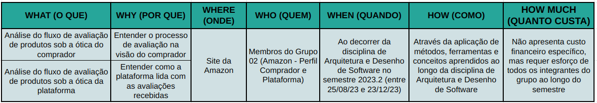
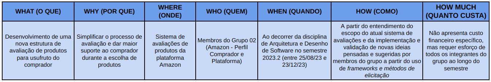
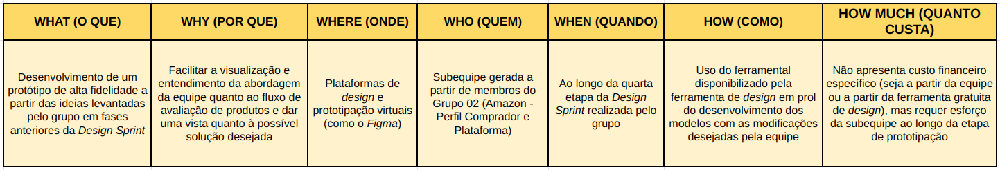

# 5W2H

## Versionamento

| **Versão** | **Data** | **Modificações** | **Autor(es)** |
| :--: | :--: | :--: | :--: |
| 0.1 | 10/09/2023 | Criação do documento e elaboração do *5W2H* | Gabriel Mariano e Lorenzo Santos |
| 0.2 | 11/09/2023 | Evolução do *5W2H* | Gabriel Mariano e Lorenzo Santos |

*Tabela 1: Versionamento*

## Introdução

O *5W2H* é um *framework* utilizado para a gestão de projetos e formulação de estratégias, se baseando a partir da resposta dada a sete perguntas derivadas de seu nome:

- **5W:**
  - *What*? (O quê?)
  - *Why*? (Por que?)
  - *Who*? (Quem?)
  - *Where*? (Onde?)
  - *When*? (Quando?)
- **2H:**
  - *How*? (Como?)
  - *How much*? (Quanto custa?)

A partir da resposta concisa dada a estas, é possível levantar debates e estabelecer corretamente o escopo do projeto.

## Metodologia

Para a execução do *5H2W*, dois membros se reuniram em plataforma virtual e, baseando-se nos conhecimentos obtidos a respeito do escopo do projeto, foi elaborada a tabela com as respostas das perguntas propostas pelo *framework*. Destaca-se que o escopo adotado para a execução do *5W2H* foi o atual projeto de análise do fluxo de avaliação de produtos da *Amazon*.

### Primeira Aplicação

| **Data e Horário** | **Ferramentas Utilizadas** | **Autores** |
| :--: | :--: | :--: |
| 10/09/2023 às 09:00 | Plataforma virtual de chamadas (*Discord*) e ferramenta digital de planilhas (*Google Planilhas*) | Gabriel Mariano e Lorenzo Santos |

*Tabela 2: Ambiente de Criação da Primeira Visão Derivada do 5W2H*

*Figura 1: Primeira Aplicação - 5W2H*

### Segunda Aplicação

Após a primeira aplicação do *framework 5W2H*, foi verificada a possibilidade de aplicação do mesmo para outros contextos derivados do projeto. Deste modo, foi realizada a apliação do *5W2H* para uma vista mais concreta sobre o desenvolvimento de uma nova estrutura de avaliação de produtos.

| **Data e Horário** | **Ferramentas Utilizadas** | **Autores** |
| :--: | :--: | :--: |
| 11/09/2023 às 20:00 | Plataforma virtual de chamadas (*Discord*) e ferramenta digital de planilhas (*Google Planilhas*) | Gabriel Mariano e Lorenzo Santos |

*Tabela 3: Ambiente de Criação da Segunda Visão Derivada do 5W2H*

*Figura 2: Segunda Aplicação - 5W2H*

### Terceira Aplicação

Aproveitando o contexto do desenvolvimento da segunda visão derivada do *5W2H* (acima), foi realizada a apliação do *5W2H* para mais uma vista derivada de um contexto do projeto, abordando dessa vez uma atividade que envolve uma maior atuação prática por parte dos membros: a **Prototipação de Alta Fidelidade**.

| **Data e Horário** | **Ferramentas Utilizadas** | **Autores** |
| :--: | :--: | :--: |
| 11/09/2023 às 20:00 | Plataforma virtual de chamadas (*Discord*) e ferramenta digital de planilhas (*Google Planilhas*) | Gabriel Mariano e Lorenzo Santos |

*Tabela 4: Ambiente de Criação da Terceira Visão Derivada do 5W2H*

*Figura 3: Terceira Aplicação - 5W2H*

## Referências Bibliográficas

**SERRANO, Milene.** "AULA - PROJETO E DESENHO DE SOFTWARE". Material disponibilizado pela docente em ambiente virtual. Acesso em 10 set. 2023.

**Sebrae Santa Catarina**. "*5W2H*: o que é, para que serve e por que usar na sua empresa". Disponível em: <https://www.sebrae-sc.com.br/blog/5w2h-o-que-e-para-que-serve-e-por-que-usar-na-sua-empresa>. Acesso em 10 set. 2023.

**A Monitoria**. "*5W2H* - Definição de temas". Disponível em: <https://2019-2-arquitetura-desenho.github.io/wiki/dinamica_seminario_I/definicao_tema/5W2H/>. Acesso em 10 set. 2023.