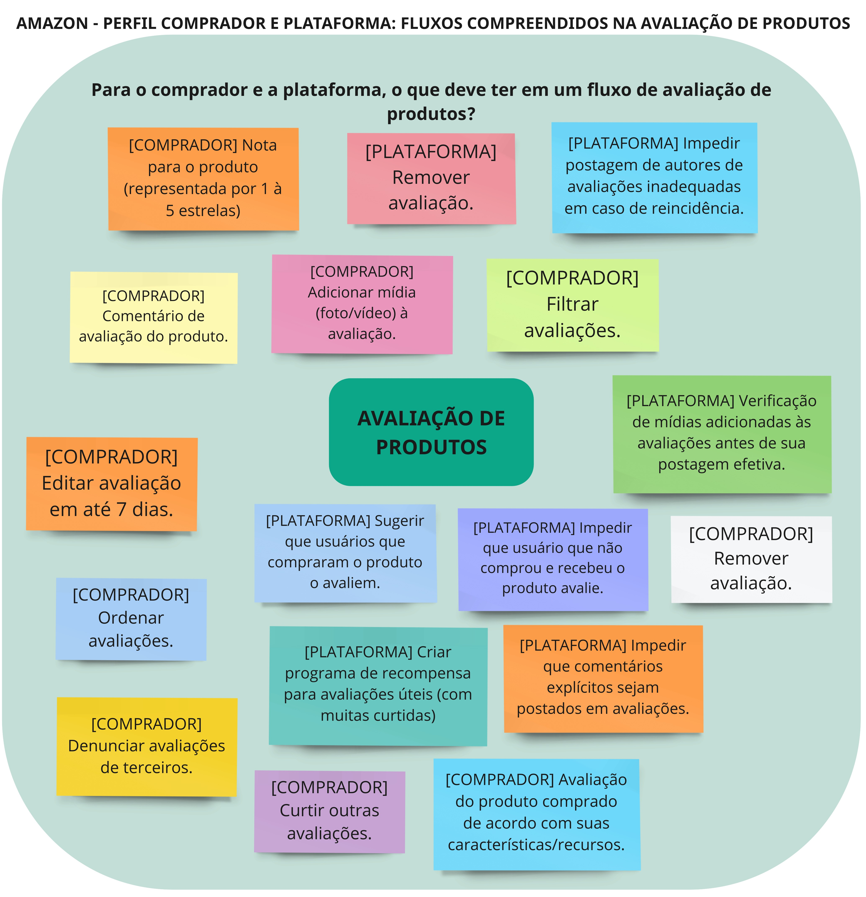
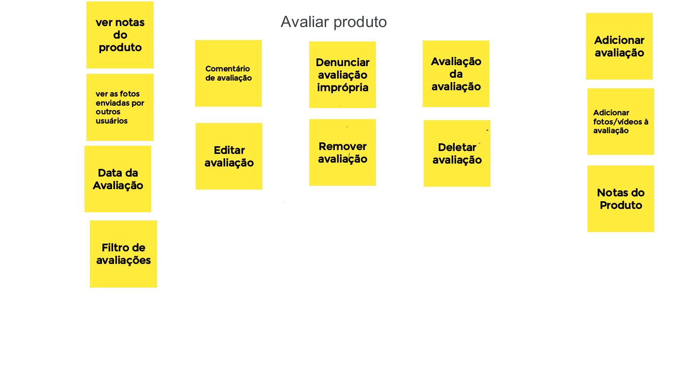
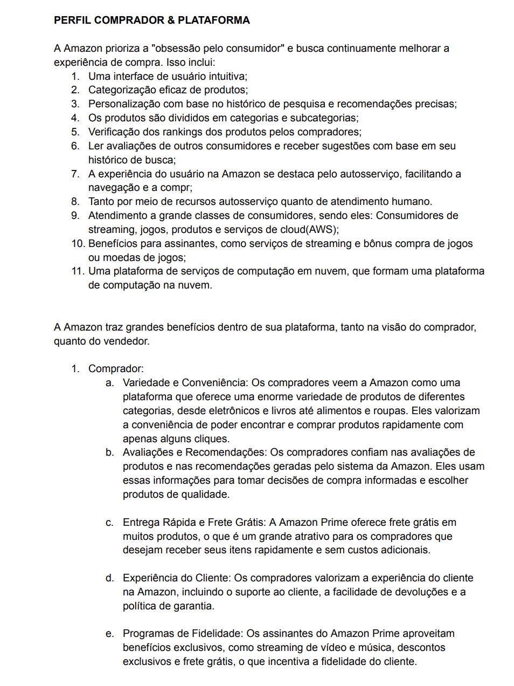
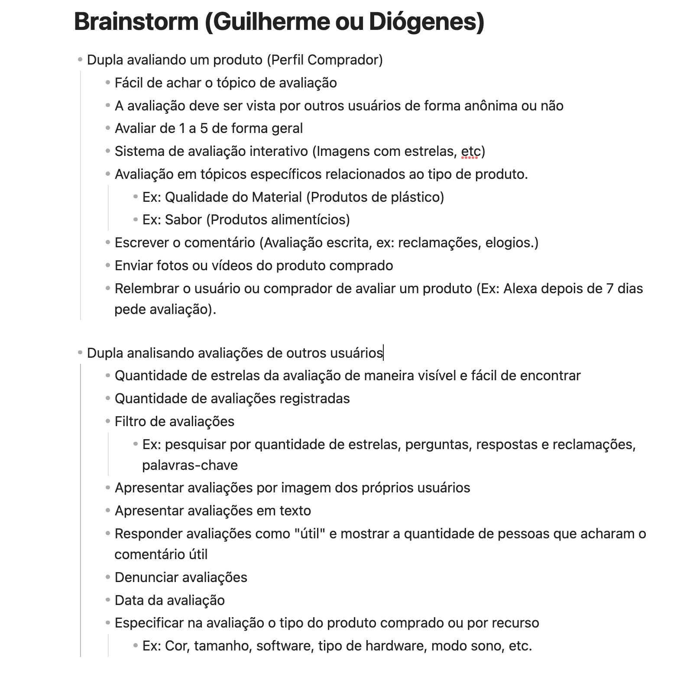
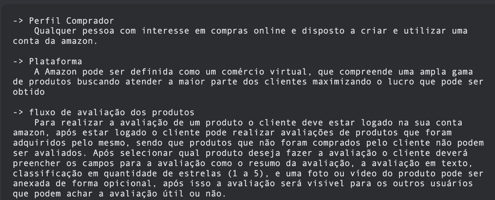

# Design Sprint

## Versionamento

| **Versão** | **Data** | **Modificações** | **Autor(es)** |
| :--: | :--: | :--: | :--: |
| 0.1 | 10/09/2023 | Criação do documento e definição do teamplate dos artefatos | Diógenes e Guilherme |
| 0.2 | 12/09/2023 | Adição de Introdução, Metodologia da Desgin Sprint no artefato | Diógenes e Guilherme |
| 0.3 | 12/09/2023 | Adição de referências bibliográficas | Diógenes e Guilherme |
| 0.4 | 12/09/2023 | Adição de Hiperlinks em alguns artefatos produzidos pelo grupo e imagem do Brainstorm dupla 1 | Diógenes e Guilherme |
| 0.5 | 14/09/2023 | Adição do roteiro da entrevista | André C. |
| 0.6 | 14/09/2023 | Quickfixes | André C. |
| 0.7 | 15/09/2023 | Adicionado protótipo | André C. |
| 0.8 | 15/09/2023 | Corrigindo ferramentas utilizadas | André C. e Gabriel Mariano |
*Tabela 1: Versionamento*

## Introdução

Este artefato documenta o processo de design sprint realizado por nosso grupo em um contexto de projeto de Arquitetura e Desenho de Software. A design sprint é uma metodologia que visa acelerar a criação de soluções inovadoras para desafios complexos. O Design Sprint é um processo de 5 dias, desenvolvido pela Google Ventures que busca validar uma ideia com os usuários em 40 horas.

## Design Sprint (Como funciona?)

Design Sprint é um processo exclusivo de cinco dias para validação de ideias e solução de desafios. E isso é feito por meio da criação de protótipos e teste de ideias com os clientes. Basicamente, a design sprint é dividida em 5 fases desenvolvidas ao longo de 5 dias. **OBS: No caso deste grupo, alguns dos horários planejados para os dias da design sprint foram modificados para se adaptar com os horários dos membros.**

### Fases da Design Sprint

Dia 1: Unpack

O primeiro dia do design sprint é voltado para o mapeamento e compreensão do problema e/ou desafio do projeto. Têm-se um compilado de insights, produzidos com a participação de todos. Geralmente, utiliza-se o **brainstorming**. As discussões estruturadas do primeiro dia criam um caminho para a semana de sprint

Dia 2: Sketch

No segundo dia, as ideias para soluções são apresentadas e votadas pelas equipes. Têm-se desenhos de várias ideias, utilizando como base tudo que foi acordado
na fase anterior, e com foco na visão de cada indivíduo sobre esse escopo. No caso deste grupo, foi padronizado o uso de Rich Picture, 5W2H, Diagrama Causa-Efeito e Mapa Mental.

Dia 3: Decision

As soluções geradas pelo grupo são filtradas e lapidadas, definindo uma única solução a ser prototipada. Têm-se a seleção/escolha da melhor ideia, a qual guiará o desenvolvimento do protótipo.

Dia 4: Prototype

Uma parte time concentra-se em gerar um protótipo mais próximo do real. Outra parte do time prepara os testes do próximo dia.

Dia 5: Test

Nesta última etapa da metodologia, o protótipo já está pronto. É, então, o momento de iniciar a validação com usuários. No caso deste grupo, foi utlizado uso de questionários com clientes e usuários da plataforma

## Metodologia

Unpack : 07/09 ao 09/09
Sketch: 09/09 ao 12/09
Decision: 12/09
Prototype: 12/09 ao 14/09

### Unpack (07/09 ao 09/09)
Nessa fase inicial, realizamos nossa primeira reunião, na qual decidimos dividir o grupo em duplas para realizar os brainstormings.
Após a conclusão de todos os brainstormings em duplas, realizamos uma reunião de consolidação das ideias no dia 09/09/2023. Durante esta reunião, foram apresentadas e discutidas as propostas de todas as duplas. Com base nessas discussões, chegamos a um consenso sobre as ideias mais promissoras. As ideias apresentadas durante os brainstormings servirão como base para o próximo estágio do nosso design sprint.

#### Brainstorming da Dupla 1
- **Data:** 09/09/2023
- **Membros da Dupla:** Gabriel Mariano e Lorenzo Santos
- **Ferramentas Utilizadas:** Miro e Discord

Clique para exibir a figura do brainstorming da Dupla 1

#### Brainstorming da Dupla 2
- **Data:** 09/09/2023
- **Membros da Dupla:** Felipe Candido Moura e André Corrêa
- **Ferramentas Utilizadas:** Miro e Discord

Clique para exibir a figura do brainstorming da Dupla 2

#### Brainstorming da Dupla 3
- **Data:** 09/09/2023
- **Membros da Dupla:** Eduardo Schuindt e Pedro Lucas
- **Ferramentas Utilizadas:** Google Docs e Discord

Clique para exibir a figura do brainstorming da Dupla 3

#### Brainstorming da Dupla 4
- **Data:** 09/09/2023
- **Membros da Dupla:** Diógenes Júnior e Guilherme Kishimoto
- **Ferramentas Utilizadas:** Obisidian e Discord

Clique para exibir a figura do brainstorming da Dupla 4

#### Brainstorming da Dupla 5
- **Data:** 09/09/2023
- **Membros da Dupla:** Arthur Taylor e Thiago Oliveira
- **Ferramentas Utilizadas:** Bloco de Notas e Discord

Clique para exibir a figura do brainstorming da Dupla 5

### Sketch (09/09 ao 12/09)
Nesta etapa, desenvolvemos artefatos com base nos insights obtidos no Brainstorming da fase anterior. Para essa tarefa cada uma das duplas assumiu a responsabilidade pela criação de um artefato específico. Os artefatos produzidos nesta fase foram os seguintes:

#### Rich Picture 

- **Data:** 11/09/2023
- **Membros da Dupla:** Eduardo Santos e Pedro Lucas
- **Ferramentas Utilizadas:** LucidChart e Discord

>  [Rich Picture](Base/Artefatos/RichPic.md).

#### 5W2H

- **Data:** 11/09/2023
- **Membros da Dupla:** Gabriel Mariano e Lorenzo Santos
- **Ferramentas Utilizadas:** Miro e Discord

>  [5W2H](Base/Artefatos/5W2H.md).

#### Mapa Mental

- **Data:** 11/09/2023
- **Membros da Dupla:** Arthur Taylor e Thiago Oliveira
- **Ferramentas Utilizadas:** Canva e Discord

>  [Mapa Mental](Base/Artefatos/mapa-mental.md).

#### Diagrama Causa Efeito

- **Data:** 08/09/2023
- **Membros da Dupla:** André Corrêa e Felipe Moura
- **Ferramentas Utilizadas:** LucidChart e Discord

>  [Causa Efeito](Base/Artefatos/DiagramaIshikawa.md).

### Decision (12/09)

Nesta fase, realizamos uma reunião de equipe para discutir e avaliar os artefatos gerados durante a fase de Sketch. A equipe se reuniu para tomar uma decisão sobre como avançar para o desenvolvimento do protótipo. O artefato principal criado nesta etapa é a 'Ata da Reunião de Decisão'. A seguir está o link para o artefato:

- **Data:** 12/09/2023
- **Membros:** Todos os membros do grupo
- **Ferramentas Utilizadas:** Discord

>  [Ata da Reunião de Decisão](Atas/Reuniao_12-09-23.md).

### Prototype (12/09 ao 14/09)
Durante esta fase, nossa equipe criou dois tipos de protótipos, sendo um de baixa fidelidade, o qual foi utilizado para auxiliar na montagem do protótipo de alta fidelidade, e um de alta fidelidade, que nos garante avaliar, na fase futura, nossos insights elicitados nas fases anteriores de maneira abrangente e iterativa. Através desse protótipo, podemos visualizar as funcionalidades, a usabilidade e a experiência do usuário, garantindo que nossos conceitos sejam traduzidos com precisão em um produto de software bem projetado. A seguir estão os nossos protótipos:

>  [Prototipacção](Base/Artefatos/Prototipacao.md).

#### Protótipo de Baixa Fidelidade
- **Data:** 13/09/2023
- **Membros da Dupla:** Subequipe (conforme ata de reunião)
- **Ferramentas Utilizadas:** Discord, Papel e Caneta

>  [Prototipo de Baixa Fidelidade](Base/Artefatos/Prototipacao.md?id=telas-prototipo-de-baixa-fidelidade).

#### Protótipo de Alta Fidelidade
- **Data:** 14/09/2023
- **Membros da Dupla:** Subequipe (conforme ata de reunião)
- **Ferramentas Utilizadas:** Discord e Figma

>  [Ata da Reunião de Decisão](Atas/Reuniao_12-09-23.md).

### Test

Nesta etapa final do nosso design sprint adaptado, temos o objetivo de validar nossos insights e a solução concebida durante as fases anteriores atrevés de uma Entrevista. Essa fase é essencial para garantir que nossa solução de arquitetura e desenho de software atenda efetivamente aos requisitos e expectativas do usuário final antes de seguir para as próximas etapas do desenvolvimento. A seguir está o artefato da Entrevista utilizado para a validação:

#### Entrevista
- **Data:** 12/09/2023
- **Membros da Dupla:** André Corrêa, Gabriel Mariano, Diógenes Júnior e Felipe Moura
- **Ferramentas Utilizadas:** Google docs e Discord

>  [Validacao_Entrevista](Base/Artefatos/Validacao_Entrevista.md).

## Referências Bibliográficas
> <a id="FTF1Ref" href="#FTF1">1.</a> [Aprender Arquitetura e Desenho de Software – Começando Professor(a): Milene Serrano](https://aprender3.unb.br/course/view.php?id=19535&section=1). Acessado em: 09 de setembro de 2023.

> <a id="FTF1Ref" href="#FTF1">2.</a> [Design Sprint (Resumo)](https://medium.com/gobee/design-sprint-resumo-3a5b634bd311). Acessado em: 09 de setembro de 2023.

> <a id="FTF1Ref" href="#FTF1">3.</a> [Design sprint, um passo a passo para inovação e empreendedorismo](https://www.flowlabdigital.com.br/design-sprint-um-passo-a-passo-para-inovacao-e-empreendedorismo/). Acessado em: 09 de setembro de 2023.

> <a id="FTF1Ref" href="#FTF1">4.</a> [INSIGHTS Design Sprint: entenda o que é e como funciona](https://www.actionlabs.com.br/insights/design-sprint-entenda-o-que-e-e-como-funciona/#:~:text=Como%20funciona%20o%20m%C3%A9todo%20Design,ideias%20em%20uma%20hip%C3%B3tese%20test%C3%A1vel.). Acessado em: 09 de setembro de 2023.