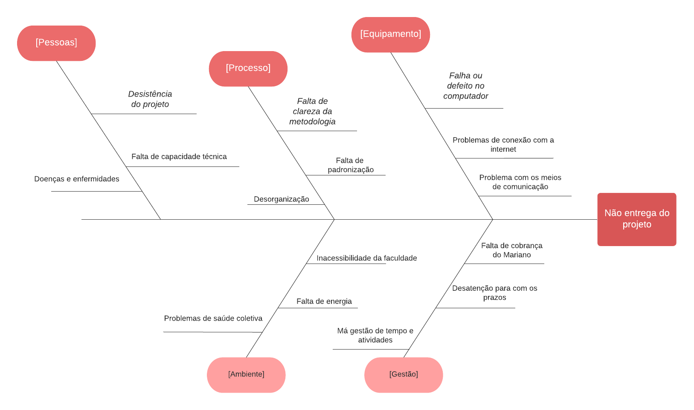

# Diagrama de Ishikawa (Causa-Efeito)

## Versionamento

| **Versão** | **Data** | **Modificações** | **Autor(es)** |
| :--: | :--: | :--: | :--: |
| 0.1 | 11/09/2023 | Criação e elaboração do artefato | André Corrêa da Silva e Felipe Candido de Moura |

*Tabela 1: Versionamento*

## Introdução

O Diagrama de Ishikawa (ou Causa-Efeito) consiste em uma ferramenta de análise e solução de problemas. Tem como base um "efeito" e suas causas divididas em grupos de semelhança associados, tais quais: pessoa, gestão, processo, equipamento, ambiente.

## Metodologia

A ferramenta foi aplicada em conjunto por dois participantes, durante uma reunião no aplicativo _Discord_ com o auxílio da aplicação _LucidChart_ para a modelagem do diagrama, tal qual descrita na Tabela 2. O artefato em questão (Figura 1), foi produzido levando em consideração a não *entrega do trabalho* como problema alvo, em conjunto com a técnica de brainstorm para definir as causas.

| **Data e Horário** | **Ferramentas Utilizadas** | **Autores** |
| :--: | :--: | :--: |
| 11/09/2023 às 19:00 | Plataforma virtual de chamadas _*Discord*_ em conjunto à ferramenta _*LucidChart*_|  André Corrêa da Silva e Felipe Candido de Moura |

*Tabela 2: Informações da reunião de elaboração do artefato*

### Diagrama de Ishikawa (Causa-Efeito) - Versão 1.0

*Figura 1: Diagrama de Ishikawa (Causa-Efeito) - v1.0*

## Referências Bibliográficas

**SERRANO, Milene.** "SLIDE - ARQUITETURA E DESENHO DE SOFTWARE". Material disponibilizado pela docente em ambiente virtual. Acesso em 11 set. 2023.

**BLOG ABRI MINHA EMPRESA**. "DIAGRAMA DE CAUSA E EFEITO (ISHIKAWA)| O Que É e Como Funciona Essa Ferramenta de Qualidade?". Disponível em: <https://www.youtube.com/watch?v=KJkGBJBh5LI>. Acesso em 11 set. 2023.

**LUCID CHART**. Disponível em: <https://www.lucidchart.com/pages/pt>. Acesso em 11 set. 2023.