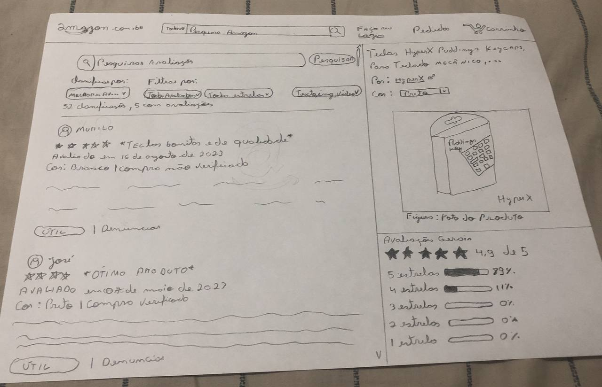

# Prototipação

## Versionamento

| **Versão** | **Data** | **Modificações** | **Autor(es)** |
| :--: | :--: | :--: | :--: |
| 0.1 | 14/09/2023 | Criação do documento | Thiago Oliveira |
| 0.2 | 15/09/2023 | Adição dos Protótipos de Alta Fidelidade | André Corrêa e Gabriel Mariano |
| 0.3 | 15/09/2023 | Correção de imagens | André Corrêa e Gabriel Mariano |

*Tabela 1: Versionamento*

## Introdução

As prototipações desempenham um papel crucial em projetos de software, independentemente do seu nível de fidelidade. Os prototipos de baixa fidelidade que como o proprio nome diz, possuem uma baixa fidelidade com a aplicação final idealizada, permitem que os desenvolvedores e designers comuniquem ideias de forma rápida e econômica, e os prototipos de Alta Fidelidade, possuindo uma fidelidade altamente proxima á da aplicação final são importantes para validar conceitos e funcionalidades com maior detalhe.

Dito isto, este documento tem como objetivo apresentar os prototipos, tanto de baixa quanto de alta fidelidade, feitos pelo grupo, e também a maneira escolhida para faze-los.

## Metodologia

### Escolha das telas

Primeiramente para a realização do prototipo de baixa e de alta fidelidade, foi feita uma reunião para sintetizar a parte da amazon designada para estudo do grupo e as funcionalidades extras idealizadas, e a partir disso escolher as telas mais
importantes e impactantes para se mostrar, as quais foram: [Tela de visualização de Avaliações](), [Tela de Avaliação do Produto]() e [Tela de Troca de Pontos]().

### Prototipo de Baixa Fidelidade

Após a escolha das telas, partimos para a realização do prototipo de baixa fidelidade, o qual foi feito uma divisão de uma dupla por tela, porém com cada membro da dupla fazendo sua própria tela, para termos várias opçoes rápidas de design e idéias
para cada tela.

### Prototipo de Alta Fidelidade

Após a realização das telas do prototipo de baixa fidelidade, foi feito uma divisão em duplas novamente para cada tela, porém com cada dupla trabalhando em uma unica tela e tendo que discutir as ideias para tal tela de acordo com o prototipo de baixa
fidelidade,  para assim juntar ideias ou até isolar uma ideia de uma das telas feitas e realizar o prototipo de alta fidelidade.

## Telas Prototipo de Baixa Fidelidade

*Figura 1: Tela de Avaliação do Produto*

*Figura 2: Tela de Avaliação do Produto V.2*

*Figura 3: Tela de Troca de Pontos*

*Figura 4: Tela de Troca de Pontos V.2*

*Figura 5: Tela de Visualizar Avaliações*

*Figura 6: Tela de Visualizar Avaliações V.2 pagina 1*

*Figura 7: Tela de Visualizar Avaliações V.2 pagina 2*

*Figura 8: Tela de Visualizar Avaliações V.2 pagina 3*

*Figura 9: Tela de Visualizar Avaliações V.2 pagina 4*

*Figura 10: Tela de Visualizar Avaliações V.2 pagina 5*

*Figura 11: Tela de Visualizar Avaliações V.2 pagina 6*

## Telas Prototipo de Alta Fidelidade

### Protótipo de Visualização das Avaliações

*Figura 12: Tela de Visualização de Avaliações*

### Protótipo de Implementação dos Filtros

*Figura 13: Tela de Implementação dos filtros*

### Protótipo de Troca de Pontos

*Figura 14: Tela de Troca de Pontos*

### Protótipo de Criação de Avaliações

*Figura 15: Tela de Visualização de Avaliações*

### Visualização do Protótipo do Figma

<!DOCTYPE html>
<html lang="en">

<body>

<iframe style="border: 1px solid rgba(0, 0, 0, 0.1);" width="800" height="450" src="https://www.figma.com/embed?embed_host=share&url=https%3A%2F%2Fwww.figma.com%2Ffile%2F76HdsqRDztVFu2Ygnsf8rZ%2FPrototipo%3Ftype%3Ddesign%26node-id%3D0%253A1%26mode%3Ddesign%26t%3DYLzeDyc6J6Jq2HyK-1" allowfullscreen></iframe>

</body>
</html>

*Figura 16: Protótipo no Figma*

## Referências Bibliográficas

**SERRANO, Milene.** "AULA - PROJETO E DESENHO DE SOFTWARE". Material disponibilizado pela docente em ambiente virtual. Acesso em 10 set. 2023.
