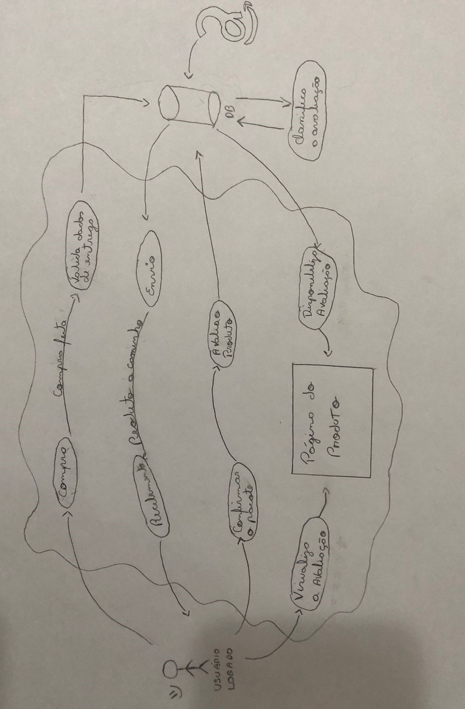

# Rich Picture

## Versionamento

| **Versão** |  **Data**  |                  **Modificações**                   |                                       **Autor(es)**                                       |
| :--------: | :--------: | :-------------------------------------------------: | :---------------------------------------------------------------------------------------: |
|    0.1     | 11/09/2023 | Criação do documento e elaboração do _Rich Picture_ | [Pedro Lucas](https://github.com/PedroLSF) e [Eduardo Santos](https://github.com/edudsan) |

_Tabela 1: Versionamento_

## Introdução

O _Rich Pictures_ é uma técnica de visualização que permite compreender o funcionamento de um sistema, identificando seus principais atores, ações e consequências. Este documento tem como finalidade apresentar de maneira clara o processo de avaliação envolvido na compra de um produto na plataforma da Amazon

## Metodologia

A dupla se reuniu pessoalmente e, após realizar uma pesquisa aprofundada sobre o fluxo de compra e avaliação de produtos na plataforma da Amazon, obteve uma compreensão abrangente de como esse processo é conduzido. Com o conhecimento adquirido e a conscientização sobre a importância do sistema, eles decidiram dar início à criação da primeira versão do Rich Picture. Essa representação visual busca expressar de forma clara e abrangente o escopo e as dinâmicas envolvidas nesse complexo processo de compra.

| **Data e Horário**  |       **Ferramentas Utilizadas**        |         **Autores**          |
| :-----------------: | :-------------------------------------: | :--------------------------: |
| 11/09/2023 às 09:00 | Horário disponibilizado em Sala de Aula | Pedro Lucas e Eduardo Santos |

_Tabela 2: Ambiente de Criação do Artefato Derivado do Rich Picture_

_Figura 1: Primeira Versão do Rich Picture_

No Rich Picture desenvolvido, é possível observar dois elementos-chave: o usuário logado e a Amazon. O sistema é centralizado em torno do processo de compra e entrega de um produto, que segue um fluxo de cima para baixo. Nesse processo, o usuário confirma o recebimento do pacote e fornece uma avaliação para o produto. O banco de dados, por sua vez, classifica essa avaliação como verificada ou não verificada e a disponibiliza na página do produto. Assim, outros usuários podem visualizar essa avaliação e tomar decisões informadas com base nessa feedback.

## Referências Bibliográficas

**Amazon Ajuda** - Como comprar na Amazon. Disponível em: <https://www.amazon.com.br/gp/help/customer/display.html?nodeId=G8UYX7LALQC8V9KA>. Acessado em: 11/09/2023.

**Requisitos de Software (Grupo MEI)** - Aplicativos Analisados. Disponível em: <https://requisitos-de-software.github.io/2022.2-MEI/Planejamento/AplicativosAnalisados/> Acessado em: 11/09/2023.
