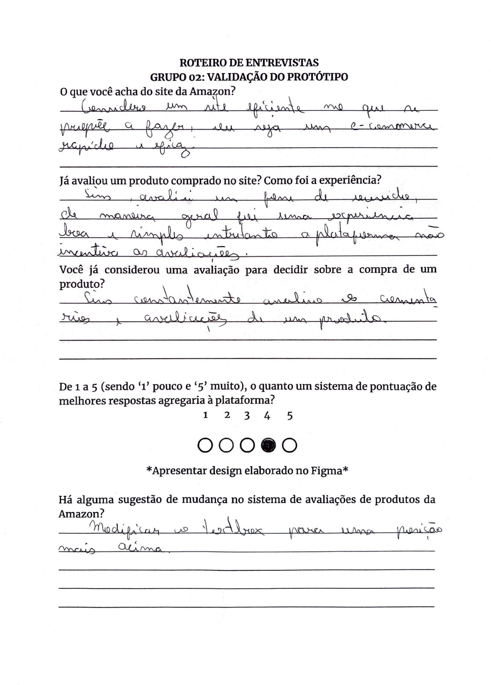
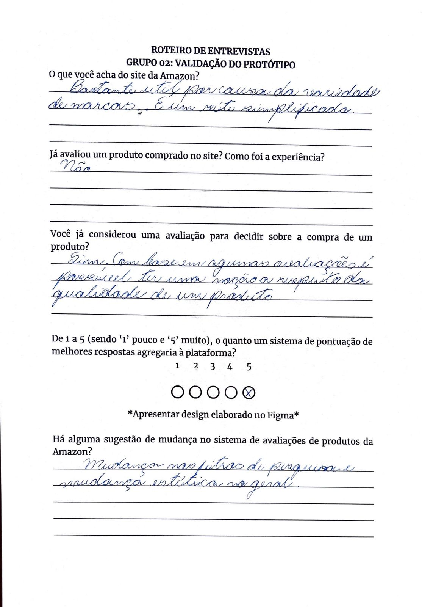

# Entrevista

## Versionamento

| **Versão** | **Data** | **Modificações** | **Autor(es)** |
| :--: | :--: | :--: | :--: |
| 0.1 | 14/09/2023 | Criação do documento e definição do teamplate dos artefatos | Diógenes, Gabriel Mariano, André Corrêa e Felipe Moura |
| 0.2 | 15/09/2023 | Realização e Adição das Entrevistas | Diógenes, Gabriel Mariano, André Corrêa e Felipe Moura |

*Tabela 1: Versionamento*

## Introdução

Para a validação do [**Protótipo de Alta Fidelidade**](Base/Artefatos/Prototipacao.md) desenvolvido para a equipe e a subsequente conclusão da última etapa prevista para a [**Design Sprint**](Base/Artefatos/DesignSprint.md), optou-se por realizar entrevistas com terceiros conforme o roteiro de entrevistas previamente desenvolvido pela equipe.

Deste modo, todos os artefatos desenvolvidos ao longo dessa etapa podem ser encontrados adiante.

## Roteiro Entrevista

<!DOCTYPE html>
<html lang="en">

<body>

 <embed src="Base/Artefatos/entrevistas/roteiro.pdf" width="800px" height="1000px" />

</body>
</html>

*Figura 1: Roteiro de Entrevista*

## Entrevistas Realizadas

Abaixo, temos todas as quatro entrevistas realizadas pela equipe com terceiros (de áreas diversas).

### Primeira Entrevista

<!DOCTYPE html>
<html lang="en">

<body>

 <embed src="Base/Artefatos/entrevistas/entrevista1.pdf" width="800px" height="1000px" />

</body>
</html>

*Figura 2: Primeira Entrevista*

### Segunda Entrevista

<!DOCTYPE html>
<html lang="en">

<body>

 <embed src="Base/Artefatos/entrevistas/entrevista2.pdf" width="800px" height="1000px" />

</body>
</html>

*Figura 3: Segunda Entrevista*

### Terceira Entrevista

*Figura 4: Terceira Entrevista*

### Quarta Entrevista

*Figura 5: Quarta Entrevista*

## Conclusão

Conforme pode ser observado acima, foram ressaltados muitos pontos positivos a respeito da plataforma *Amazon* em si, sendo destacadas algumas observações quanto à falta de incentivos para a avaliação de produtos, sendo destacado também a grande utilizade das avaliações no processo de escolha e compra de um produto.

Destaca-se que a implementação de um sistema de pontuação para as avaliações de produtos, conforme pensado em etapas anteriores por membros da equipe, foi amplamente avaliada como sendo "muito agregadora".

Todavia, ressalta-se a necessidade de realizar entrevistas com um grupo maior de pessoas de modo que seja possível alcançar um resultado mais conclusivo e possivelmente menos uniforme.