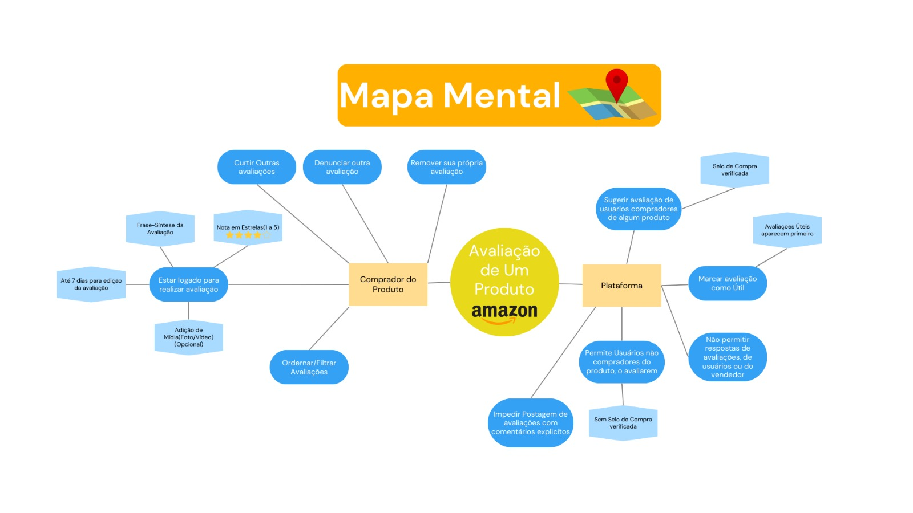

# Mapa Mental

## Versionamento

| **Versão** | **Data** | **Modificações** | **Autor(es)** |
| :--: | :--: | :--: | :--: |
| 0.1 | 11/09/2023 | Criação do documento e e elaboração do mapa mental | Arthur e Thiago |

*Tabela 1: Versionamento*

## Introdução

Um mapa mental tem por objetivo principal representar conceitos complicados de uma mais simples e objetiva. Um mapa mental deve levar sua ideia central no meio, e partindo desta ideia central novas ideias devem ser adicionadas. 

## Metodologia

Para a criação do artefato dois integrantes do grupo se reuniram de maneira virtual, utilizando as ideias que foram apresentadas durante o *brainstorming* realizado pelo grupo, foi elaborado o mapa mental buscando representar no artefato as ideias de uma forma mais simples.

| **Data e Horário** | **Ferramentas Utilizadas** | **Autores** |
| :--: | :--: | :--: |
| 11/09/2023 às 20:30 | Plataforma virtual de chamadas (*Discord*) e ferramenta digital de design (*Canva*) | Arthur Taylor e Thiago Oliveira |

*Tabela 2: Ambiente de criação do artefato derivado do Mapa mental*

*Figura 1: Mapa Mental*

## Referências Bibliográficas

**SERRANO, Milene.** "AULA - PROJETO E DESENHO DE SOFTWARE". Material disponibilizado pela docente em ambiente virtual. Acesso em 11 set. 2023.

**Lucidchart**. "*Mapa Mental*: o que é mapa mental e como fazer?". Disponível em: <https://www.lucidchart.com/pages/pt/o-que-e-mapa-mental-e-como-fazer>. Acesso em 11 set. 2023.

