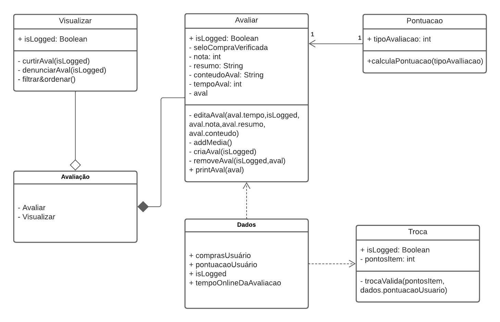

# Diagrama de Classes

## Versionamento

| **Versão** | **Data** | **Modificações** | **Autor(es)** |
| :--: | :--: | :--: | :--: |
| 0.1 | 07/10/2023 | Criação do documento e adição de diagrama de classes | Thiago Oliveira e Arthur Taylor |
| 0.2 | 08/10/2023 | Revisão dos artefatos: pequenas correções de erros | André Corrêa, Felipe Cândido e Gabriel Mariano |

*Tabela 1: Versionamento*

## Introdução

O diagrama de classes é um dos diagramas estáticos *UML*, sendo tal diagrama utilizado sumariamente para descrever a estrutura estática de um sistema, mostrando as classes, seus atributos, métodos e os relacionamentos entre as classes, fornecendo uma visão estática da estrutura do sistema, sem considerar o comportamento dinâmico ou as interações em tempo de execução entre os objetos.

## Aplicação

Seguindo o material de consulta (apresentado nas referências bibliográficas), foi desenvolvido o diagrama de classes. 

| **Data** | **Participantes** | **Ferramenta Utilizada** |
| :--: | :--: | :--: |
| 06/10/2023 | Arthur Taylor e Thiago Oliveira | [*Lucid Chart*](https://lucidchart.com.br) |

*Tabela 2: Documentação do Diagrama de Classe*

*Figura 1: Diagrama de classes*

O diagrama acima representa as classes e seus atributos, objetos, métodos e relacionamentos que acreditamos ser necessários para se modelar o fluxo de avaliação de um produto, em conjunto com as funcionalidades adicionais propostas pelo grupo, dos pontos e troca de pontos.

## Referências Bibliográficas

**Milene Serrano**. "AULA - MODELAGEM UML DINÂMICA". Disponibilizado em ambiente virtual pela docente. Acesso em 06 out 2023.