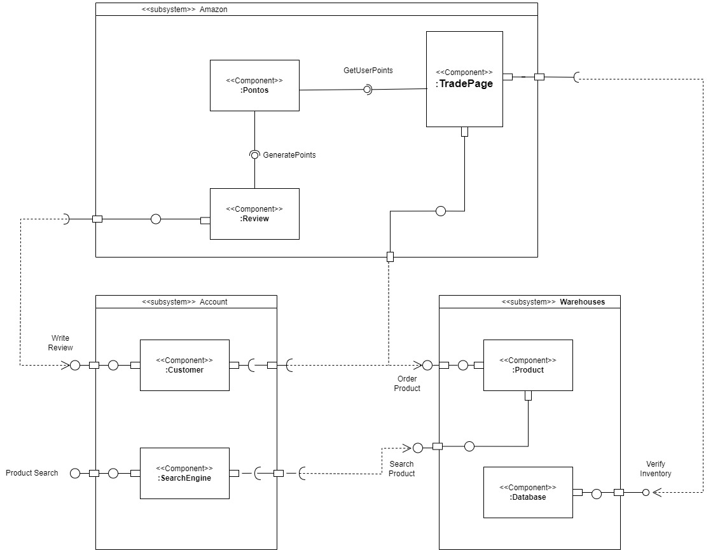

# Diagrama de Classe

## Versionamento

| **Versão** | **Data** | **Modificações** | **Autor(es)** |
| :--: | :--: | :--: | :--: |
| 0.1 | 07/10/2023 | Criação do documento e adição do diagrama de componentes | Pedro Lucas, Eduardo Santos e Lorenzo Alves |

*Tabela 1: Versionamento*

## Introdução

O diagrama de componentes da UML é uma representação visual que ilustra como as classes devem estar organizadas por meio da noção de componentes de trabalho. Esse diagrama é uma ferramenta poderosa para visualizar a arquitetura de um sistema, mostrando como os diferentes componentes (que podem ser classes, módulos, pacotes ou até mesmo sistemas inteiros) interagem e se relacionam. Ele ajuda a entender a estrutura geral do sistema e como suas partes se encaixam para realizar as funcionalidades desejadas.

## Metodologia

O documento foi iniciado e desenvolvido por três membros do grupo durante duas reuniões principais. Durante essas reuniões, conseguimos discutir ideias e nos concentrar nos pontos em que todos os integrantes concordaram. Finalmente, com a ajuda de conteúdos relevantes, conseguimos desenvolver o diagrama de componentes de forma eficaz.

| **Data** | **Participantes** | **Ferramenta Utilizada** |
| :--: | :--: | :--: |
| 06/10/2023 | Pedro Lucas, Eduardo Santos e Lorenzo Alves | [*Draw.io*](https://app.diagrams.net) |

*Tabela 2: Documentação do Diagrama de Componentes*

*Figura 1: Diagrama de componentes*

A figura acima ilustra o comportamento dos componentes e suas respectivas dependências. Um exemplo disso é a relação entre o cliente, as avaliações e os pontos que podem ser utilizados na página de troca para adquirir novos pedidos. Esses elementos são representados como componentes distintos que possuem uma certa interdependên

## Referências Bibliográficas

**Milene Serrano**. "AULA - MODELAGEM UML DINÂMICA". Disponibilizado em ambiente virtual pela docente. Acesso em 06 out 2023.
