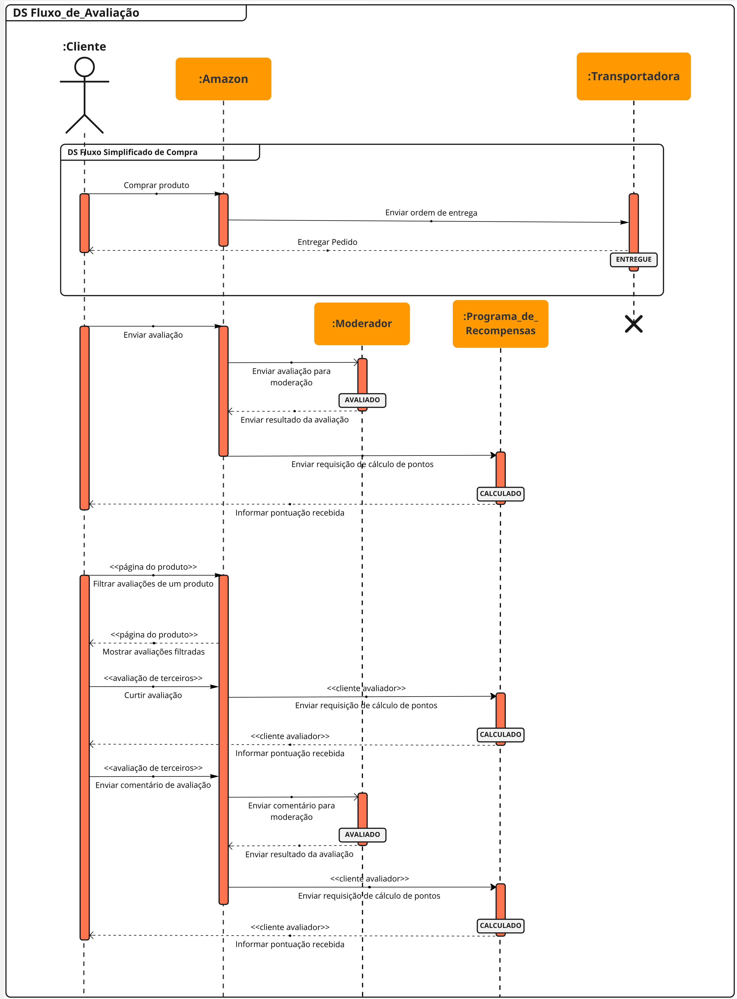

# Diagrama de Sequência

## Versionamento

| **Versão** | **Data** | **Modificações** | **Autor(es)** |
| :--: | :--: | :--: | :--: |
| 0.1 | 07/10/2023 | Criação do documento e adição de diagrama de sequências | André Corrêa e Gabriel Mariano |

*Tabela 1: Versionamento*

## Introdução

Dada a necessidade de representação dos fluxos e sequências do processo de avaliação de produtos na plataforma *Amazon*, optou-se por modelar estes utilizando o **diagrama de sequências** com a **notação *UML***.

Diagramas de sequência são descritos por **Fakhroutdinov** (20XX, traduzido) em [*UML Sequence Diagrams*](https://www.uml-diagrams.org/sequence-diagrams.html) como sendo focados em "descrever uma interação ao focar na sequência de mensagens que são trocadas, juntamente com suas especificações de ocorrência correspondentes nas *lifelines*".

Portanto, o presente artefato apresentará melhor as interações decorrentes do fluxo definidor do escopo do projeto a partir dos diagramas de sequência inframencionados.

## Aplicação

Seguindo o material de consulta (apresentado nas referências bibliográficas), foi desenvolvido o diagrama de sequências para o fluxo de avaliação de produtos da Amazon, compreendendo as *lifelines* tanto para os clientes, quanto para a plataforma e seus relativos (Moderação, Programa de Recompensas e Transportadora). 

| **Data** | **Participantes** | **Ferramenta Utilizada** |
| :--: | :--: | :--: |
| 06/10/2023 | André Corrêa e Gabriel Mariano | [*Miro*](https://miro.com/app/dashboard/) |

*Tabela 2: Documentação do Diagrama de Sequências*

*Figura 1: Diagrama de Sequências - Fluxo de Avaliação de Produtos*

No diagrama acima, podem ser observados três focos de ocorrências de sequências: a representação simplificada do fluxo de compras (haja vista que o fluxo de compras é abordado de maneira mais aprofundada por outras equipes), o fluxo de criação de avaliações e o fluxo de interação com avaliações de terceiros.

## Referências Bibliográficas

**Milene Serrano**. "AULA - MODELAGEM UML DINÂMICA". Disponibilizado em ambiente virtual pela docente. Acesso em 06 out 2023.

**Kirill Fakhroutdinov**. "UML Sequence Diagrams". Disponível em: <https://www.uml-diagrams.org/sequence-diagrams.html>. Acesso em 06 out 2023.