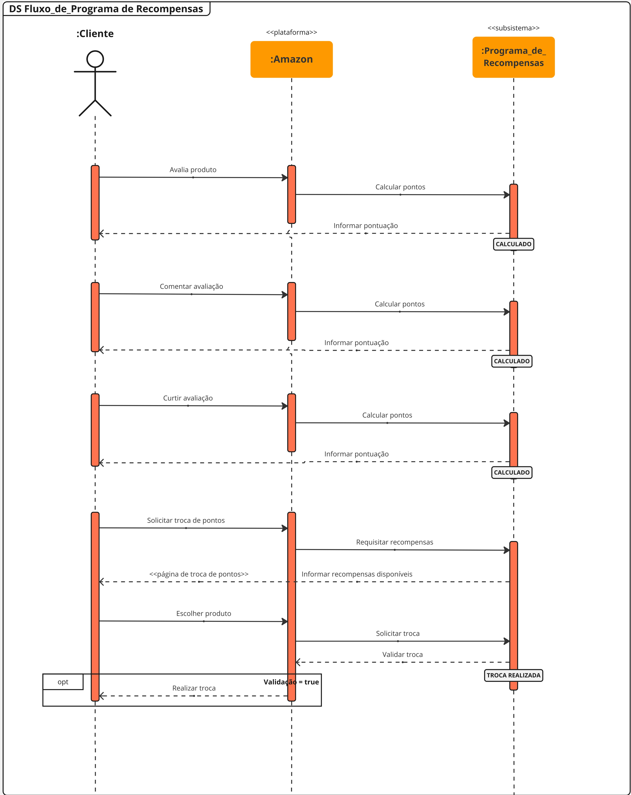

# Diagrama de Sequência

## Versionamento

| **Versão** | **Data** | **Modificações** | **Autor(es)** |
| :--: | :--: | :--: | :--: |
| 0.1 | 07/10/2023 | Criação do documento e adição de diagrama de sequências | André Corrêa e Gabriel Mariano |
| 0.2 | 08/10/2023 | Adição diagrama de sequência | Felipe Moura |
| 0.3 | 09/10/2023 | Adição da segunda versão dos diagramas de sequência | André Corrêa e Gabriel Mariano |
| 0.3.1 | 23/11/2023 | Adição da possibilidade de "contração" das primeiras e segundas versões de ambos os diagramas para melhor visualização. Adição das terceiras versões de ambos os diagramas, apresentando pequenas correções. | André Corrêa e Gabriel Mariano |

*Tabela 1: Versionamento*

## Introdução

Dada a necessidade de representação dos fluxos e sequências do processo de avaliação de produtos na plataforma *Amazon*, optou-se por modelar estes utilizando o **diagrama de sequências** com a **notação *UML***.

Diagramas de sequência são descritos por **Fakhroutdinov** (20XX, traduzido) em [*UML Sequence Diagrams*](https://www.uml-diagrams.org/sequence-diagrams.html) como sendo focados em "descrever uma interação ao focar na sequência de mensagens que são trocadas, juntamente com suas especificações de ocorrência correspondentes nas *lifelines*".

Portanto, o presente artefato apresentará melhor as interações decorrentes do fluxo definidor do escopo do projeto a partir dos diagramas de sequência inframencionados.

## Aplicação

Seguindo o material de consulta (apresentado nas referências bibliográficas), foram desenvolvidos os diagrama de sequências para o fluxo de avaliação de produtos da Amazon, compreendendo as *lifelines* tanto para os clientes, quanto para a plataforma e seus relativos (Moderação, Programa de Recompensas e Transportadora). 

### Fluxo de Avaliação de Produtos

#### Primeira Versão

 <strong> CLIQUE PARA EXIBIR A PRIMEIRA VERSÃO DO DIAGRAMA DE SEQUÊNCIAS </strong> 

| **Data** | **Participantes** | **Ferramenta Utilizada** |
| :--: | :--: | :--: |
| 06/10/2023 | André Corrêa e Gabriel Mariano | [*Miro*](https://miro.com/app/dashboard/) |

*Tabela 2: Documentação do Diagrama de Sequências*

*Figura 1: Diagrama de Sequências - Fluxo de Avaliação de Produtos (Primeira Versão)*

No diagrama acima, podem ser observados três focos de ocorrências de sequências: a representação simplificada do fluxo de compras (haja vista que o fluxo de compras é abordado de maneira mais aprofundada por outras equipes), o fluxo de criação de avaliações e o fluxo de interação com avaliações de terceiros.

#### Segunda Versão

 <strong> CLIQUE PARA EXIBIR A SEGUNDA VERSÃO DO DIAGRAMA DE SEQUÊNCIAS </strong> 

| **Data** | **Participantes** | **Ferramenta Utilizada** |
| :--: | :--: | :--: |
| 09/10/2023 | André Corrêa e Gabriel Mariano | [*Miro*](https://miro.com/app/dashboard/) |

*Tabela 3: Documentação do Diagrama de Sequências*

*Figura 2: Diagrama de Sequências - Fluxo de Avaliação de Produtos (Segunda Versão)*

Foram realizadas modificações pontuais em relação à primeira versão do diagrama, onde foram alteradas as descrições de alguns fluxos, adicionados *stereotypes* e modificadas as posições de alguns elementos.

#### Terceira Versão

| **Data** | **Participantes** | **Ferramenta Utilizada** |
| :--: | :--: | :--: |
| 23/11/2023 | André Corrêa e Gabriel Mariano | [*Miro*](https://miro.com/app/dashboard/) |

*Tabela 4: Documentação do Diagrama de Sequências*

*Figura 3: Diagrama de Sequências - Fluxo de Avaliação de Produtos (Terceira Versão)*

 Foram realizadas modificações pontuais em relação à segunda versão do diagrama de acordo o <i> feedback </i> dado pela docente na correção da segunda entrega, onde destacou-se a necessidade de um maior uso de <i> stereotypes </i> no diagrama. Tendo tal necessidade em vista, foram feitas algumas pequenas modificações no diagrama de modo a torná-lo mais adequado. 

### Fluxo de Troca de Pontos

#### Primeira Versão

 <strong> CLIQUE PARA EXIBIR A PRIMEIRA VERSÃO DO DIAGRAMA DE SEQUÊNCIAS </strong> 

| **Data** | **Participantes** | **Ferramenta Utilizada** |
| :--: | :--: | :--: |
| 08/10/2023 | Felipe Moura | [*Miro*](https://miro.com/app/dashboard/) |

*Tabela 5: Documentação do Diagrama de Sequências da Troca de Pontos*

*Figura 4: Diagrama de Sequências - Fluxo de Troca de Pontos (Primeira Versão)*

Foi feito também, seguindo os moldes usados na Figura 1, um diagrama de sequência (Figura 3) que visa detalhar o uso do sistema de troca de pontos.

#### Segunda Versão

 <strong> CLIQUE PARA EXIBIR A SEGUNDA VERSÃO DO DIAGRAMA DE SEQUÊNCIAS </strong> 

| **Data** | **Participantes** | **Ferramenta Utilizada** |
| :--: | :--: | :--: |
| 09/10/2023 | Felipe Moura, Gabriel Mariano e André Corrêa | [*Miro*](https://miro.com/app/dashboard/) |

*Tabela 6: Documentação do Diagrama de Sequências da Troca de Pontos*

*Figura 5: Diagrama de Sequências - Fluxo de Troca de Pontos (Segunda Versão)*

Foram realizadas modificações pontuais em relação à primeira versão do diagrama, onde foram modificados alguns fluxos, contando também com a alteração das descrições de alguns destes.

#### Terceira Versão

| **Data** | **Participantes** | **Ferramenta Utilizada** |
| :--: | :--: | :--: |
| 23/11/2023 | André Corrêa e Gabriel Mariano | [*Miro*](https://miro.com/app/dashboard/) |

*Tabela 7: Documentação do Diagrama de Sequências*

*Figura 6: Diagrama de Sequências - Fluxo de Troca de Pontos (Terceira Versão)*

 Foram realizadas modificações pontuais em relação à segunda versão do diagrama de acordo o <i> feedback </i> dado pela docente na correção da segunda entrega, sendo adicionados mais <i> stereotypes </i> ao diagrama. 

## Referências Bibliográficas

**Milene Serrano**. "AULA - MODELAGEM UML DINÂMICA". Disponibilizado em ambiente virtual pela docente. Acesso em 06 out 2023.

**Kirill Fakhroutdinov**. "UML Sequence Diagrams". Disponível em: <https://www.uml-diagrams.org/sequence-diagrams.html>. Acesso em 06 out 2023.

**Creately**. "Tutorial do Diagrama de Sequência: Guia completo com exemplos". Diponível em: <https://creately.com/blog/pt/diagrama/tutorial-do-diagrama-de-sequencia/>. Acesso em 08 out 2023.