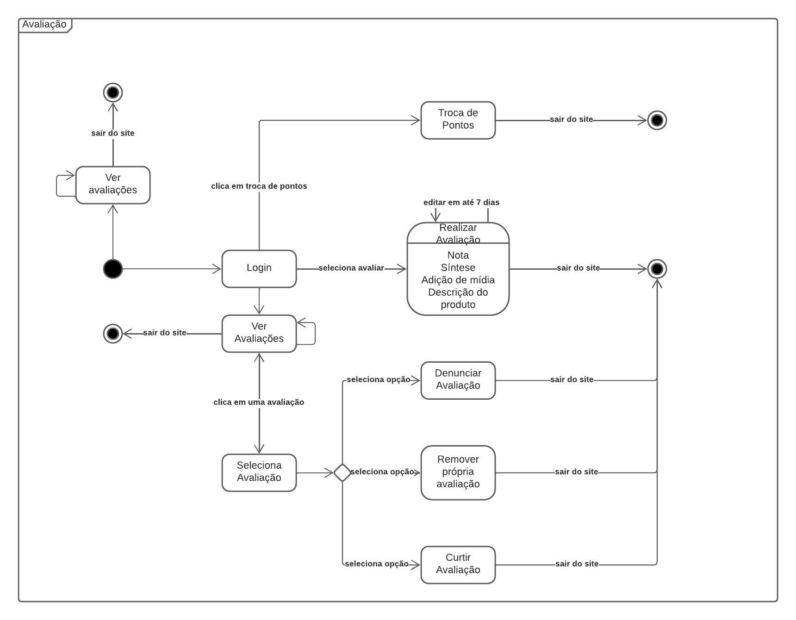

# Diagrama de Estados

## Versionamento

| **Versão** | **Data** | **Modificações** | **Autor(es)** |
| :--: | :--: | :--: | :--: |
| 0.1 | 07/10/2023 | Criação do documento e adição de diagrama de estados | Arthur Taylor e Thiago Oliveira |
| 0.2 | 09/10/2023 | Pequena correção de *link* | André Corrêa e Gabriel Mariano |

*Tabela 1: Versionamento*

## Introdução

O diagrama de estados é mais um diagrama de modelagem dinâmica UML, ele consiste em um diagrama apresentando os diferentes estados que podem ser alcnçados durante a utilização do software. 

Este diagrama modela uma quantidade de processos finitas, evidenciando o ponto de entrada do fluxo, os processos que ocorrem e os seus pontos de saída.

## Aplicação

Seguindo o material de consulta (apresentado nas referências bibliográficas), foi desenvolvido o diagrama de estados. 

| **Data** | **Participantes** | **Ferramenta Utilizada** |
| :--: | :--: | :--: |
| 06/10/2023 | Arthur Taylor e Thiago Oliveira | [*Lucidchart*](https://lucidchart.com) |

*Tabela 2: Documentação do Diagrama de Estados*

*Figura 1: Diagrama de Estados - Fluxo de Avaliação de Produtos*

O diagrama acima representa os estados que podem ser alcançados durante a utilização da parte de avaliação do site analisado por um usuário, evidenciando as partes que dependem de um login do usuário e as partes que não nescessitam deste processo, além de evidenciar as condições que devem ser satisfeitas para alcançar estes estados.

## Referências Bibliográficas

**Milene Serrano**. "AULA - MODELAGEM UML DINÂMICA". Disponibilizado em ambiente virtual pela docente. Acesso em 06 out 2023.

**Kirill Fakhroutdinov**. "UML Estates Diagrams". Disponível em: <https://www.uml-diagrams.org/state-machine-diagrams.html#choice-pseudostate>. Acesso em 06 out 2023.