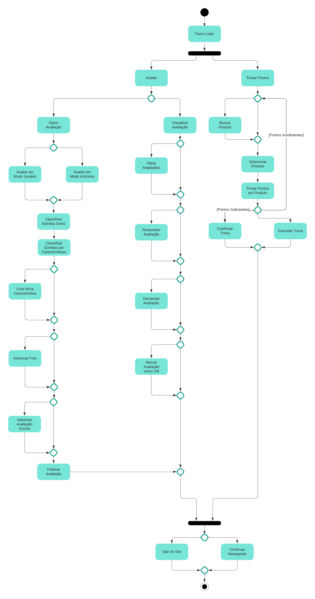
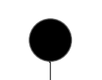
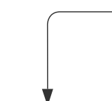
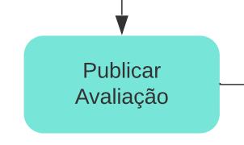
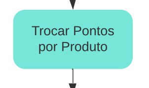
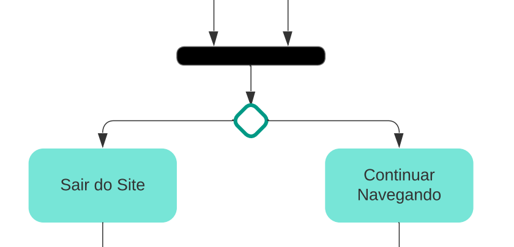
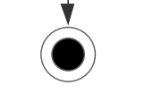
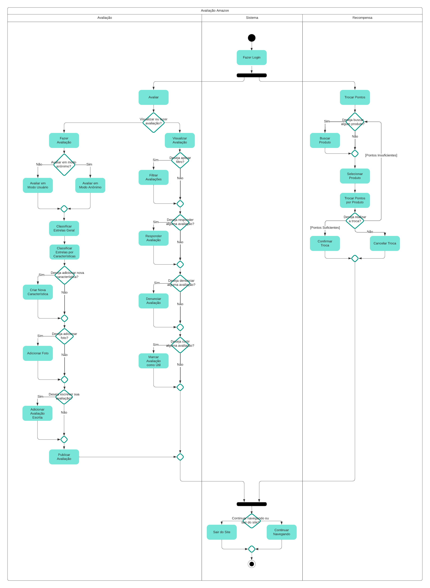

# Diagrama de Atividades

## Versionamento

| **Versão** | **Data** | **Modificações** | **Autor(es)** |
| :--: | :--: | :--: | :--: |
| 0.1 | 08/10/2023 | Criação do documento e definição do teamplate dos artefatos | Diógenes Júnior e Guilherme |
| 0.2 | 08/10/2023 | Adição de Introdução, Metologia e Imagem do Diagrama de Atividade | Diógenes Júnior e Guilherme |
| 0.3 | 08/10/2023 | Descrição dos componentes do Diagrama de Atividade |  Diógenes Júnior e Guilherme |
| 0.4 | 09/10/2023 | Adição da versão 2 do Diagrama de Atividades | Diógenes Júnior e Guilherme |
| 0.5 | 09/10/2023 | Correção de pequenos erros de digitação | Felipe Moura e Gabriel Mariano |

*Tabela 1: Versionamento*

## Introdução

Diagramas de atividade capturam ações e seus resultados. Eles focam o trabalho executado na implementação de uma operação (método), e suas atividades numa instância de um objeto. O Diagrama de atividade mostra o fluxo sequencial das atividades, é normalmente utilizado para demonstrar as atividades executadas por uma operação específica do sistema. Consistem em estados de ação, que contêm a especificação de uma atividade a ser desempenhada por uma operação do sistema. Decisões e condições, como execução paralela, também podem ser mostrados na diagrama de atividade.

Um diagrama de atividade pode ser usado com diferentes propósitos inclusive:
- Para capturar os trabalhos que serão executados quando uma operação é disparada (ações). Este é o uso mais comum para o diagrama de atividade. 
- Para capturar o trabalho interno em um objeto. 
- Para mostrar como um grupo de ações relacionadas podem ser executadas, e como elas vão afetar os objetos em torno delas.
- Para mostrar como uma instância pode ser executada em termos de ações e objetos.

## Metodologia

O artefato foi criado por dois membros do grupo durante reuniões tanto presenciais quanto virtuais. Eles usaram conteúdos do ambiente Aprender3 e realizaram pesquisas como referência para desenvolver o diagrama de atividade.

## Primeira Versão 

| **Data e Horário** | **Ferramentas Utilizadas** | **Autores** |
| :--: | :--: | :--: |
| 06/10/2023 às 20:00 | Aplicativo de diagramação baseado na web (LucidChart) e Aplicativos de Chamadas (Discord) | Diógenes Júnior e Guilherme |

*Tabela 2: Ambiente de criação do artefato Diagrama de Atividade Primeira Versão*

Versão 1 - Diagrama de Atividades

*Figura 1: Diagrama de Atividade*

### Nó Inicial

Corresponde ao Ponto de Início da Atividade Modelada (nesse caso Fluxo de Avaliação).

*Figura 2: Nó Inicial*

### Fluxo 

Descreve a sequência na qual as atividades do fluxo de avaliação se realizam.

*Figura 3: Fluxo*

### Ações 

Corresponde aos trabalhos que vão ser executados quando uma operação específica do sistema é disparada. Ex:

A ação abaixo indica que o usuário pretende executar uma avaliação a respeito de um produto adquirido no site da Amazon.

*Figura 4: Ação Avaliar*

A ação abaixo indica que o usuário pretende publicar uma avaliação realizada por tal após uma compra.

*Figura 5: Ação Publicar Avaliação*

A ação abaixo indica que o usuário pretende trocar os pontos que ele recebeu ao fazer uma avaliação por um produto do site Amazon.

*Figura 6: Ação Trocar Pontos por Produto*

### Decisão

Corresponde a um único fluxo de entrada e vários fluxos de saída. As decisões são mutuamente exclusivas, logo o fluxo segue apenas um dos caminhos.

A imagem abaixo, representa apenas um fluxo de entrada na qual esbarra em uma decisão que determina qual fluxo o usuário vai seguir, seja Avaliar em Modo Usuário ou Avaliar em Modo Anônimo.

*Figura 7: Decisão*

### Divergência ou Nó de Bifurcação

Corresponde ao um ponto no diagrama no qual duas ou mais tarefas podem se iniciar em paralelo.

A imagem abaixo, representa duas tarefas que podem ser iniciadas em paralelo no Fluxo de Avaliação da Amazon. Nesse caso, podem tando dar início a ação Avaliar, caso o usuário queria avaliar o produto recebido, quanto dar início em Trocar Pontos, caso o usuário queira trocar os pontos recebidos através dessa avaliação realizada no site.

*Figura 8: Divergência*

### Convergência

Ponto no qual duas ou mais tarefas paralelas se unem para dar início a uma nova tarefa única

A imagem abaixo representa uma convergência no Fluxo de Avaliação da Amazon, no qual as ações de avaliar ou trocar pontos são convergidas para a decisão que redireciona para as ações de Sair do Site ou Continuar Navegando

*Figura 9: Convergência*

### Nó Final

Ponto onde termina a atividade modelada

*Figura 10: Nó Final*

## Segunda Versão

| **Data e Horário** | **Ferramentas Utilizadas** | **Autores** |
| :--: | :--: | :--: |
| 09/10/2023 às 12:00 | Aplicativo de diagramação baseado na web (LucidChart) e Aplicativos de Chamadas (Discord) | Diógenes Júnior e Guilherme |

*Tabela 3: Ambiente de criação do artefato Diagrama de Atividade Segunda Versão*

*Figura 11: Diagrama de Atividade Segunda Versão*

Na segunda versão do Diagrama de Atividades, a estrutura base do fluxos permaneceu a mesma da primeira versão. As diferenças na estrutura do diagrama estão relacionadas as piscinas que dividem as ações e os fluxos do diagrama em Avaliação, Sistema e Recompensa. Além disso, foram adicionados aos losangos de decisão perguntas que representam qual decisão o usuário deve tomar e o resultado (sim ou não) representando qual fluxo o sistema segue após a tomada de decisão.

## Referências Bibliográficas
> <a id="FTF1Ref" href="#FTF1">1.</a> [Aprender Arquitetura e Desenho de Software – Começando Professor(a): Milene Serrano](https://aprender3.unb.br/course/view.php?id=19535&section=1). Acessado em: 08 de outubro de 2023.

> <a id="FTF1Ref" href="#FTF1">2.</a> [IBM-Diagramas de Atividades](https://www.ibm.com/docs/pt-br/rational-soft-arch/9.7.0?topic=diagrams-activity). Acessado em: 09 de outubro de 2023.

> <a id="FTF1Ref" href="#FTF1">3.</a> [O que é um Diagrama de Atividade UML - Introdução](https://www.youtube.com/watch?v=_1vHj_j3zDY&ab_channel=B%C3%B3sonTreinamentos). Acessado em: 09 de outubro de 2023.