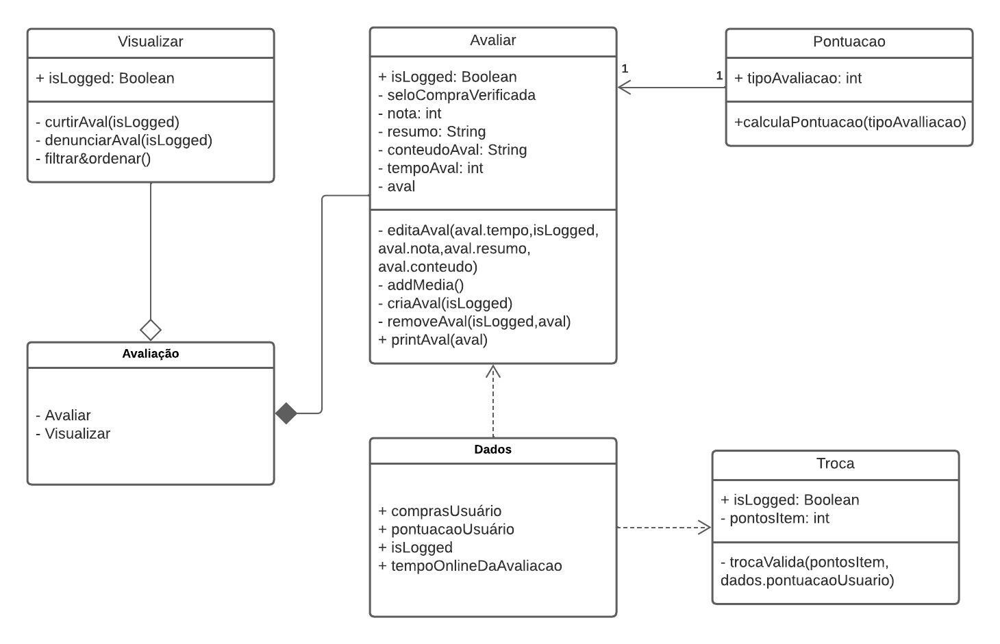
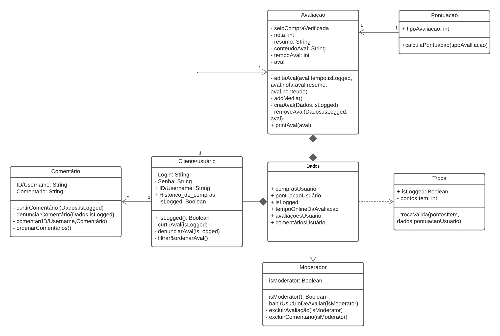
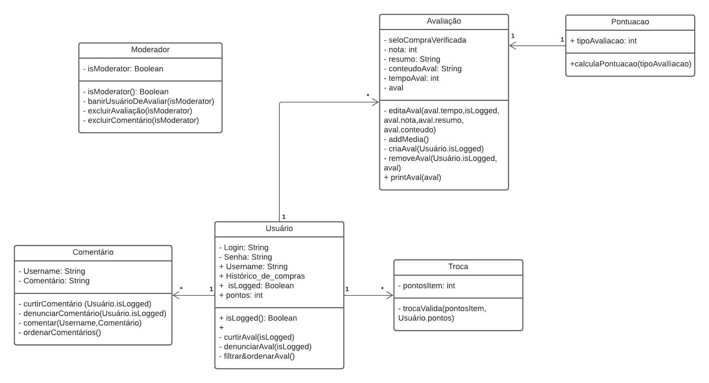

# Diagrama de Classes

## Versionamento

| **Versão** | **Data** | **Modificações** | **Autor(es)** |
| :--: | :--: | :--: | :--: |
| 0.1 | 07/10/2023 | Criação do documento e adição de diagrama de classes | Thiago Oliveira e Arthur Taylor |
| 0.2 | 08/10/2023 | Revisão dos artefatos: pequenas correções de erros | André Corrêa, Felipe Cândido e Gabriel Mariano |
| 0.3 | 08/10/2023 | Adição de novo diagrama de classe, corrigido de acordo com a revisão | Thiago Oliveira |
| 0.4 | 09/10/2023 | Adição de novo diagrama de classe, corrigido de acordo com os pontos vistos pela professora | Thiago Oliveira |
| 0.5 | 09/10/2023 | Pequenas correções de detalhes, breve organização do artefato e correção de link | André Corrêa e Gabriel Mariano  | 

*Tabela 1: Versionamento*

## Introdução

O diagrama de classes é um dos diagramas estáticos *UML*, sendo tal diagrama utilizado sumariamente para descrever a estrutura estática de um sistema, mostrando as classes, seus atributos, métodos e os relacionamentos entre as classes, fornecendo uma visão estática da estrutura do sistema, sem considerar o comportamento dinâmico ou as interações em tempo de execução entre os objetos.

## Aplicação

Seguindo o material de consulta (apresentado nas referências bibliográficas), foi desenvolvido os diagramas de classes v1.0, v2.0 e v3.0. 

### Primeira Versão

| **Data** | **Participantes** | **Ferramenta Utilizada** |
| :--: | :--: | :--: |
| 06/10/2023 | Arthur Taylor e Thiago Oliveira | [*Lucidchart*](https://lucidchart.com) |

*Tabela 2: Documentação do Diagrama de Classe*

*Figura 1: Diagrama de classes v1.0*

### Segunda Versão

*Figura 2: Diagrama de classes v2.0*

### Terceira Versão

*Figura 3: Diagrama de classes v3.0*

Os diagramas acima representam as classes e seus atributos, objetos, métodos e relacionamentos que acreditamos ser necessários para se modelar o fluxo de avaliação de um produto, em conjunto com as funcionalidades adicionais propostas pelo grupo, dos pontos e troca de pontos.

A versão 1.0 foi feita baseada no diagrama de pacotes, já a versão 2.0 foi uma correção dos erros e adição de classes e métodos faltantes de acordo com a revisão realizada, agora a versão 3.0 foi feito de acordo com as correções apontadas pela professora durante a apresentação do grupo, que foram factiveis até a data limite de entrega.

## Referências Bibliográficas

**Milene Serrano**. "AULA - MODELAGEM UML DINÂMICA". Disponibilizado em ambiente virtual pela docente. Acesso em 06 out 2023.

**Milene Serrano**. "AULA - MODELAGEM UML ESTÁTICA". Disponibilizado em ambiente virtual pela docente. Acesso em 06 out 2023.