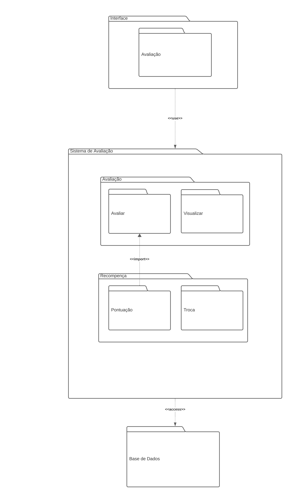

# Diagrama de Pacotes

## Versionamento

| **Versão** | **Data** | **Modificações** | **Autor(es)** |
| :--: | :--: | :--: | :--: |
| 0.1 | 07/10/2023 | Criação do documento e definição do template dos artefatos | Diógenes e Guilherme |
| 0.2 | 07/10/2023 | Adição da Introdução, Metodologias e a imagem do Diagrama de Pacotes | Diógenes Júnior e Guilherme |
| 0.3 | 08/10/2023 | Correção de alguns detalhe da documentação do artefato | Diógenes Júnior e Guilherme |
| 0.4 | 08/10/2023 | Revisão do artefato: pequenas correções no documento | André Corrêa, Felipe Moura e Gabriel Mariano |
| 0.5 | 09/10/2023 | Modificação da estrutura do Diagrama de Pacotes | Diógenes Júnior e Guilherme |

*Tabela 1: Versionamento*

## Introdução

Diagramas de pacotes são diagramas estruturais comumente usados para simplificar os diagramas de classe complexos e organizar as classes em pacotes. Um pacote é uma coleção de elementos relacionados, incluindo diagramas, documentos, classes e pacotes de eventos. Além disso, o diagrama de pacotes oferece uma valiosa visibilidade de alto nível para grandes projetos e sistemas.

Um diagrama de pacotes é comumente usado para organizar os elementos de um sistema de alto nível, para que os pacotes possam ser usados ​​na organização do sistema, contendo documentos, diagramas e outros. Abaixo, listamos algumas dicas para uso do diagrama de pacotes.

- Um diagrama de pacotes pode ser usado para simplificar diagramas complexos de classe e organizar as classes em pacotes.
- Ele também pode ser usado para definir os agrupamentos entre pacotes e outros pacotes ou objetos.
- Transforma estruturas complexas de tecnologia, educação e outros campos em pacotes simplificados.

## Metodologia

O artefato foi criado por dois membros do grupo durante reuniões, tanto presenciais quanto virtuais. Eles usaram conteúdos do ambiente de aprendizado e realizaram pesquisas como referência para desenvolver o diagrama de pacotes.

## Primeira Versão

| **Data e Horário** | **Ferramentas Utilizadas** | **Autores** |
| :--: | :--: | :--: |
| 06/10/2023 às 18:00 | Aplicativo de diagramação baseado na web (LucidChart) e Aplicativos de Chamadas (Discord) | Diógenes Júnior e Guilherme |

*Tabela 2: Ambiente de criação do artefato Diagrama de Pacotes Primeira Versão*

*Figura 1: Diagrama de Pacotes Primeira Versão*

## Segunda Versão

| **Data e Horário** | **Ferramentas Utilizadas** | **Autores** |
| :--: | :--: | :--: |
| 09/10/2023 às 18:00 | Aplicativo de diagramação baseado na web (LucidChart) e Aplicativos de Chamadas (Discord) | Diógenes Júnior e Guilherme |

*Tabela 3: Ambiente de criação do artefato Diagrama de Pacotes Segunda Versão*

*Figura 2: Diagrama de Pacotes Segunda Versão*

## Estrutura

O diagrama foi estruturado de acordo com cada camada do sistema

### Front-End

Corresponde ao modelo da aplicação que irá apresentar os dados e as funcionalidades ao usuário. No caso, a interface corresponde a *front-end* do Sistema de Avaliação da *Amazon*.

No caso, o fluxo possui o pacote Interface Avaliação que corresponde ao front-end destinado a realização das ações ligadas a avaliação (fazer uma avaliação, ler uma avaliação). O pacote Interface Recompensa corresponde ao front-end destinado as recompensas e pontos obitidos na avaliação de um produto. Todos esses pacotes herdam características do Interface Usuário.

### Back-End

Corresponde ao modelo *back-end* da aplicação. Basicamente, utiliza uma *API* para possibilitar a integração entre o *front-end* e a base de dados.

Nesse caso, o pacote Avaliação integra com a Interface Avaliação, referindo-se aos mecanismos estrutural do site que comanda as ações ligadas a Avaliação no sistema. O pacote Pontuação cumpre a mesma função, porém com ações ligadas ao sistema de Recompensa do Site

## Dados

O pacote **Dados** corresponde ao *database* da aplicação, onde estão armazenados as avaliações, os dados dos usuários e as tabelas modeladas de acordo com o diagrama de classes.

## Referências Bibliográficas
> <a id="FTF1Ref" href="#FTF1">1.</a> [Aprender Arquitetura e Desenho de Software – Começando Professor(a): Milene Serrano](https://aprender3.unb.br/course/view.php?id=19535&section=1). Acessado em: 06 de outubro de 2023.

> <a id="FTF1Ref" href="#FTF1">1.</a> [GitMind](https://gitmind.com/pt/diagrama-de-pacotes.html). Acessado em: 07 de outubro de 2023.