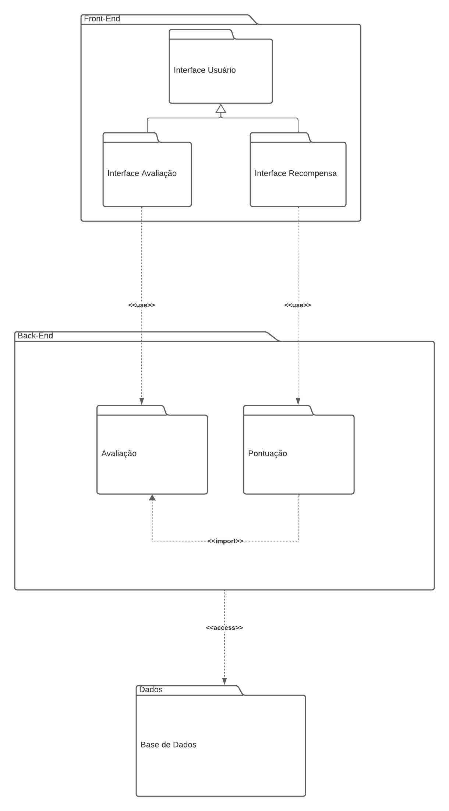

# Diagrama de Pacotes

## Versionamento

| **Versão** | **Data** | **Modificações** | **Autor(es)** |
| :--: | :--: | :--: | :--: |
| 0.1 | 07/10/2023 | Criação do documento e definição do template dos artefatos | Diógenes e Guilherme |
| 0.2 | 07/10/2023 | Adição da Introdução, Metodologias e a imagem do Diagrama de Pacotes | Diógenes Júnior e Guilherme |
| 0.3 | 08/10/2023 | Correção de alguns detalhe da documentação do artefato | Diógenes Júnior e Guilherme |
| 0.4 | 08/10/2023 | Revisão do artefato: pequenas correções no documento | André Corrêa, Felipe Moura e Gabriel Mariano |
| 0.5 | 09/10/2023 | Modificação da estrutura do Diagrama de Pacotes | Diógenes Júnior e Guilherme |
| 0.6 | 09/10/2023 | Correção de pequenos erros de digitação e de *link* de imagem | Felipe Moura e Gabriel Mariano |
| 0.7 | 29/11/2023 | Adição da terceira versão do diagrama de pacotes, descrições dos novos pacotes adicionados no diagrama e adição do detalhamento de como o diagrama foi planejado e montado | Diógenes Júnior e Guilherme Kishimoto |

*Tabela 1: Versionamento*

## Introdução

Diagramas de pacotes são diagramas estruturais comumente usados para simplificar os diagramas de classe complexos e organizar as classes em pacotes. Um pacote é uma coleção de elementos relacionados, incluindo diagramas, documentos, classes e pacotes de eventos. Além disso, o diagrama de pacotes oferece uma valiosa visibilidade de alto nível para grandes projetos e sistemas.

Um diagrama de pacotes é comumente usado para organizar os elementos de um sistema de alto nível, para que os pacotes possam ser usados ​​na organização do sistema, contendo documentos, diagramas e outros. Abaixo, listamos algumas dicas para uso do diagrama de pacotes.

- Um diagrama de pacotes pode ser usado para simplificar diagramas complexos de classe e organizar as classes em pacotes.
- Ele também pode ser usado para definir os agrupamentos entre pacotes e outros pacotes ou objetos.
- Transforma estruturas complexas de tecnologia, educação e outros campos em pacotes simplificados.

## Metodologia

O artefato foi criado por dois membros do grupo durante reuniões tanto presenciais quanto virtuais. Eles usaram conteúdos do ambiente de aprendizado e realizaram pesquisas como referência para desenvolver o diagrama de pacotes.

#### Primeira Versão

 <strong> CLIQUE PARA EXIBIR A PRIMEIRA VERSÃO DO DIAGRAMA DE PACOTES </strong> 

| **Data e Horário** | **Ferramentas Utilizadas** | **Autores** |
| :--: | :--: | :--: |
| 06/10/2023 às 18:00 | Aplicativo de diagramação baseado na web (LucidChart) e Aplicativos de Chamadas (Discord) | Diógenes Júnior e Guilherme |

*Tabela 2: Ambiente de criação do artefato Diagrama de Pacotes Primeira Versão*

*Figura 1: Diagrama de Pacotes Primeira Versão*

#### Segunda Versão

 <strong> CLIQUE PARA EXIBIR A SEGUNDA VERSÃO DO DIAGRAMA DE PACOTES </strong> 

| **Data e Horário** | **Ferramentas Utilizadas** | **Autores** |
| :--: | :--: | :--: |
| 09/10/2023 às 18:00 | Aplicativo de diagramação baseado na web (LucidChart) e Aplicativos de Chamadas (Discord) | Diógenes Júnior e Guilherme |

*Tabela 3: Ambiente de criação do artefato Diagrama de Pacotes Segunda Versão*

*Figura 2: Diagrama de Pacotes Segunda Versão*

#### Terceira Versão

| **Data e Horário** | **Ferramentas Utilizadas** | **Autores** |
| :--: | :--: | :--: |
| 28/11/2023 às 18:00 | Aplicativo de diagramação baseado na web (LucidChart) e Aplicativos de Chamadas (Discord) | Diógenes Júnior e Guilherme |

*Tabela 4: Ambiente de criação do artefato Diagrama de Pacotes Segunda Versão*

*Figura 3: Diagrama de Pacotes Terceira Versão*

## Descrição

Após reuniões, consulta à literatura sobre UML, opiniões de profissionais da área e feedback da docente da disciplina, o grupo optou por adotar a Terceira Versão do Diagrama de Pacotes como a alternativa mais abrangente e detalhada para o contexto do projeto.

Além disso, o grupo decidiu incluir pacotes que não apenas remetem à estrutura e arquitetura das tecnologias utilizadas em sistemas de e-commerce, como a Amazon, mas também especificar pacotes relacionados ao sistema e aos fluxos de avaliação da plataforma, pois essas áreas estão sendo estudadas e analisadas pelo grupo.

Finalmente, a descrição detalhada de cada pacote está apresentada abaixo, incluindo sua especificação e a razão pela qual foi incorporado no diagrama de pacotes.

## Estrutura

O diagrama foi estruturado de acordo com cada camada do sistema. Além disso, cada camada foi especificada com o pacotes presente em cada uma delas.

## Front-End

Corresponde ao modelo da aplicação que irá apresentar os dados e as funcionalidades ao usuário. No caso, a interface corresponde a *front-end* do Sistema de Avaliação da *Amazon*.

### 1 - Pages

O pacote chamado "Pages" abriga as diversas páginas da aplicação, cada uma apresentando seu conteúdo específico, design personalizado e gestão de estados correspondente.

### 1.1 - interface

O pacote chamado "interface" especifica a interface que focará no conteúdo e design da páginas correspondendes ao sistema de avaliação da plataforma.

### 1.2 - productReviews

O pacote chamado "productReviews" especifica a página da aplicação focada no conteúdo específico ligado a avaliação dos produtos disponíveis no sistema.

### 1.3 - rewards

O pacote chamado "rewards" especifica a página da aplicação focada no conteúdo específico ligado as premiações obtidas pelos clientes através da ação de avaliar um produto do sistema.

### 2 - context

O conceito de contexto refere-se a uma funcionalidade que facilita o compartilhamento de dados entre componentes e páginas sem a necessidade de transmiti-los como propriedades (parâmetros). A essência do contexto é estabelecer um "estado global" para a aplicação, especialmente para as páginas que o empregam. Nesse contexto, o pacote Context é projetado para armazenar os diversos contextos da aplicação, que serão acessados pelas páginas, facilitando a integração entre os dados e as diferentes páginas que deles necessitam.

### 3 - components

Um componente é uma instância encapsulada e autônoma de uma seção específica da interface do usuário. O propósito subjacente do pacote Components é mitigar a redundância, armazenando os componentes previamente desenvolvidos no código. Dentro desse pacote, são mantidos os componentes mais frequentemente empregados, visando à exportação facilitada para diversas páginas.

### 4 - apiRequest

Um pacote ApiRequest refere-se a um conjunto organizado de funcionalidades e métodos projetados para facilitar e gerenciar solicitações de API em um sistema de software. Ele oferece uma estrutura para a criação, envio e manipulação de requisições a interfaces de programação de aplicativos (APIs). O pacote ApiRequest tem como propósito armazenar as solicitações de API que serão executadas para viabilizar a conexão entre o frontend e o backend da aplicação.

## Back-End

Corresponde ao modelo *back-end* da aplicação. Basicamente, utiliza uma *API* para possibilitar a integração entre o *front-end* e a base de dados.

### 1 - controller

Em desenvolvimento de software, um controller é uma classe que gerencia as interações entre a interface do usuário e o resto da aplicação. Ele recebe as entradas do usuário, as processa e coordena as ações necessárias para atender às solicitações. 
No nosso contexto, o pacote Controller recebe as requisições externas do pacote Operator, onde estão armazenados os métodos relacionados às 
rotas da aplicação. Este pacote depende do pacote Validator para validar as entradas do Operator, como garantir o formato correto do campo de 
email e a correta tipagem dos itens no corpo da requisição.

### 2 - business

A camada Business abrange a implementação da lógica de negócios, incluindo regras específicas, acessos a serviços externos e tratamento de exceções. O pacote UseCase é importado no controller para permitir o acesso a essa camada, representando casos de uso detalhados pelo cliente. O Error Modules aborda o tratamento padronizado de erros na aplicação, estruturando soluções para cada tipo de erro retornado pelos UseCases. O pacote Model define os modelos da aplicação, especificando atributos e métodos para cada entidade. Os pacotes productReviews e rewards abrangem a implementação lógica e regras específicas do back-end voltado para as soluções ligadas aos componentes de avaliação da plataforma da Amazon.

### 3 - data

A camada Data é responsável pela interação com a base de dados. O pacote Repository contém métodos para acessar o banco de dados, enquanto o pacote Migration armazena as alterações no banco, como criação e exclusão de tabelas, proporcionando um versionamento das mudanças.

## Data Storage
O pacote **Data Storage** corresponde ao *database* da aplicação, onde estão armazenados as avaliações, os dados dos usuários e as tabelas modeladas.

## Referências Bibliográficas
> <a id="FTF1Ref" href="#FTF1">1.</a> [Aprender Arquitetura e Desenho de Software – Começando Professor(a): Milene Serrano](https://aprender3.unb.br/course/view.php?id=19535&section=1). Acessado em: 06 de outubro de 2023.

> <a id="FTF1Ref" href="#FTF1">1.</a> [GitMind](https://gitmind.com/pt/diagrama-de-pacotes.html). Acessado em: 07 de outubro de 2023.

> <a id="FTF1Ref" href="#FTF1">1.</a> [UML Package Diagram: Unveiling the Architecture](https://guides.visual-paradigm.com/uml-package-diagram-unveiling-the-architecture/). Acessado em: 28 de novembro de 2023.