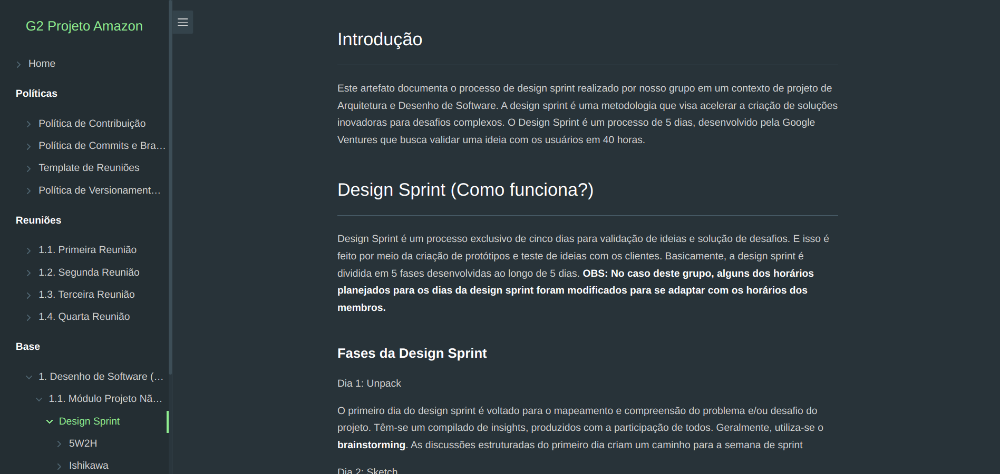
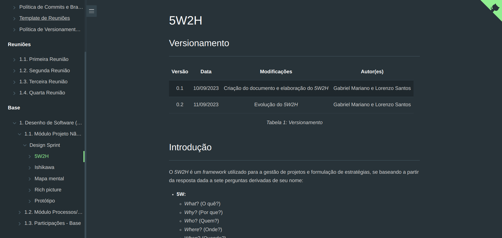

<!-- # RepositorioTemplate
Esse repositório é para ser utilizado pelos grupos como um template inicial.
As seções do Template NÃO DEVEM SER OMITIDAS, sendo TODAS RELEVANTES.
Demais diretrizes constam no Moodle.

**!! Atenção: Renomeie o seu repositório para (Ano.Semestre)_(Grupo)_(NomeDoProjeto)*. !!** 

**!! *Não coloque os nomes dos alunos no título do repositório*. !!**

**!! *Exemplo de título correto: 2023.2_G1_ProjetoPandora*. !!** 
 
 (Apague esses comentários) -->

# Amazon - Perfil Comprador e Plataforma: Fluxos das Avaliações dos Produtos

**Código da Disciplina**: FGA0208 
**Número do Grupo**: 02 

## Alunos

| **Matrícula** | **Aluno** | **Integrante** |
| :--: | :--: | :--: |
| 20/0014447  |  André Corrêa da Silva |  |
| 19/0084642  |  Arthur Taylor de Jesus Popov |  |
| 19/0105267  |  Diógenes Dantas Lélis Júnior |  |
| 20/2042927  |  Eduardo Schuindt Santos |  |
| 20/0030469  |  Felipe Candido de Moura |  |
| 20/0018167  |  Gabriel Mariano da Silva |  |
| 19/0088257  |  Guilherme Keyti Cabral Kishimoto |  |
| 19/0032821  |  Lorenzo de Lima Alves dos Santos |  |
| 19/0115564  |  Pedro Lucas Siqueira Fernandes |  |
| 19/0096071  |  Thiago Oliveira Cunha |  |

*Tabela 1: Integrantes da Equipe*

## Sobre 
<!-- Contextualize, usando referências, links, e outros materiais como fontes. -->

O presente projeto visa aprofundar os conhecimentos em **Arquitetura e Desenho de Software** por parte dos integrantes do grupo a partir do estudo e decorrente aplicação de metodologias e ferramentas sobre os **fluxos de avaliação de produtos** da plataforma [**Amazon**](https://www.amazon.com.br/), com enfoque nos pontos de vista do comprador e da plataforma.

O projeto será inicialmente dividido em quatro etapas: 
- [1. Desenho de Software (Base)](./Base/1.Base.md)
- 2. Desenho de Software (Modelagem)
- 3. Desenho de Software (Padrões de Projeto)
- 4. Desenho de Software (Arquitetura & Reutilização de Software)

## Screenshots da Primeira Entrega 

*Figura 1: Tela apresentando a página da Design Sprint*

*Figura 1: Tela apresentando a página do artefato 5W2H*

<!-- FOCO: DSW(Base)>> -->
<!-- Adicione 2 ou mais screenshots em termos de artefatos da Primeira Entrega. -->

<!-- ## Screenshots Segunda Entrega <<FOCO: DSW(Modelagem)>>
Adicione 2 ou mais screenshots em termos de artefatos da Segunda Entrega.

## <<FOCO: DSW(Padrões de Projeto)>>
Esse módulo/tópico será avaliado via Prova.
Portanto, sem necessidade de Screenshots.

## Screenshots Terceira Entrega (FINAL) <<FOCOS: Arquitetura & Reutilização de Software & PROJETO FINAL>>
Adicione 2 ou mais screenshots em termos de artefatos da Quarta Entrega. -->

## Descritivo dos Principais Aspectos Técnicos 
**Principal(is) Metodologia(s) Adotada(s)**: *Kanban*, *Pair Programming* e *SCRUM* 
**Principais Linguagens Utilizadas e/ou Pretendidas**: *Markdown* 
**Principais Tecnologias Utilizadas e/ou Pretendidas**: *Docsify*, *Trello*, *Canva*, *Miro*, *Discord* e *Telegram* 
<!-- **Principal(is) Estilo(s) Arquitetural(is) Adotado(s)**: xxxxxx  -->

## Há algo a ser executado?

( ) SIM

( x ) NÃO (momentaneamente)

<!-- Se SIM, insira um manual (ou um script) para auxiliar ainda mais os interessados na execução. -->

<!-- ## Informações Complementares 

Quaisquer outras informações adicionais podem ser descritas nessa seção. -->
